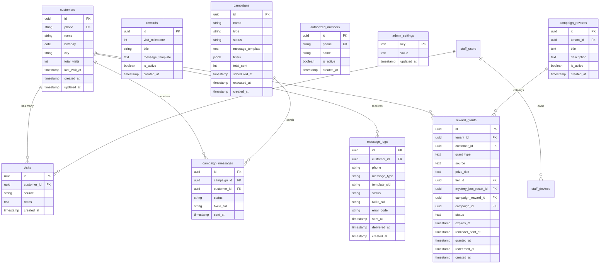

# Esquema de Base de Datos

**Base de datos:** Supabase (PostgreSQL)
**Última actualización:** 2026-07-11

---

## Diagrama ER



---

## Índice de Tablas

| # | Tabla | Descripción | RLS | Políticas |
|---|-------|-------------|-----|-----------|
| 1 | [customers](#customers) | Clientes del restaurante | SI | Admin: CRUD completo |
| 2 | [visits](#visits) | Historial de visitas | SI | Admin: CRUD completo |
| 3 | [rewards](#rewards) | Configuración de recompensas por meta | SI | Admin: CRUD completo |
| 4 | [campaigns](#campaigns) | Campañas de marketing | SI | Admin: CRUD completo |
| 5 | [campaign_messages](#campaign_messages) | Mensajes enviados por campaña | SI | Admin: lectura |
| 6 | [authorized_numbers](#authorized_numbers) | Números de meseros autorizados | SI | Admin: CRUD completo |
| 7 | [admin_settings](#admin_settings) | Configuración del admin (key-value) | SI | Admin: SELECT, INSERT, UPDATE |
| 8 | [restaurant_events](#restaurant_events) | Calendario operativo de eventos/promos con media | SI | Admin: CRUD completo |
| 9 | [restaurant_locations](#restaurant_locations) | **LA SEDE** del negocio (dejó de ser solo la geocerca): subdominio, ficha de Google, meseros y atribución | SI | Tenant: ALL (`tenant_all_restaurant_locations`, 00026) |
| 10 | [staff_users](#staff_users) | Cuentas de meseros (login con PIN) | SI | Service: ALL (backend maneja auth) |
| 11 | [staff_devices](#staff_devices) | Dispositivos de confianza registrados por supervisor | SI | Service: ALL |
| 12 | [message_logs](#message_logs) | Tracking de TODOS los mensajes WhatsApp (transaccionales + campañas) | SI | Admin: lectura; Service: INSERT/UPDATE |
| 13 | [campaign_rewards](#campaign_rewards) | Catálogo editable de premios de campaña (reactivación, referidos, promos) | SI | Admin: CRUD completo (vía service role, filtrado por tenant en código) |
| 14 | [reward_grants](#reward_grants) | El premio otorgado: pertenece a un cliente, pendiente de reclamar | SI | Admin: CRUD completo (vía service role, filtrado por tenant en código) |
| 15 | [review_events](#review_events) | Funnel del pop-up de reseñas de Google: mostrado → click → pospuesto | SI | Admin: CRUD completo (vía service role, filtrado por tenant en código) |
| 16 | [message_class_map](#message_class_map) | Catalogo: message_type -> clase de presupuesto + prioridad de cola | SI | Lectura publica (catalogo global) |
| 17 | [send_reservations](#send_reservations) | Ventana rodante de 24h: la contabilidad del limite de Meta | SI | Admin: CRUD (via service role, filtrado por tenant en codigo) |
| 18 | [send_queue](#send_queue) | Cola de goteo de envios que no cupieron hoy | SI | Admin: CRUD (via service role, filtrado por tenant en codigo) |
| 19 | [line_health_snapshots](#line_health_snapshots) | Historial de quality rating y limite de cada linea | SI | Admin: CRUD (via service role, filtrado por tenant en codigo) |
| 20 | [consent_events](#consent_events) | Libro de evidencia de opt-in/opt-out. **APPEND-ONLY** | SI | SELECT + INSERT unicamente; UPDATE/DELETE revocados |
| 21 | [template_versions](#template_versions) | Versiones de cada plantilla del catálogo: la vigente, la pendiente de Meta y el historial | SI | Admin: CRUD (vía service role, filtrado por tenant en código) |

---

## Tablas

### customers

> Almacena los datos de los clientes del restaurante.

| Columna | Tipo | Nullable | Default | Descripción |
|---------|------|----------|---------|-------------|
| `id` | `uuid` | NO | `gen_random_uuid()` | PK |
| `phone` | `text` | NO | - | Número celular (único, formato: 3XXXXXXXXX) |
| `name` | `text` | NO | - | Nombre del cliente |
| `birthday` | `date` | SI | `NULL` | Fecha de nacimiento |
| `city` | `text` | SI | `NULL` | Ciudad del cliente |
| `total_visits` | `integer` | NO | `0` | Contador total de visitas |
| `last_visit_at` | `timestamptz` | SI | `NULL` | Fecha de última visita |
| `source_channels` | `text` | NO | `'qr'` | Origen del cliente: 'qr', 'delivery' o 'both' |
| `last_campaign_at` | `timestamptz` | SI | `NULL` | Fecha de última campaña recibida (frequency cap) |
| `accepts_marketing` | `boolean` | NO | `true` | Si el cliente acepta comunicaciones de marketing |
| `whatsapp_opt_out_at` | `timestamptz` | SI | `NULL` | Último opt-out de WhatsApp (respondió SALIR/STOP/BAJA o Twilio rechazó por 21610/63016). NULL = puede recibir. Se limpia con opt-in (ALTA/START). |
| `checkin_lat` | `numeric(10,8)` | SI | `NULL` | Última latitud de check-in |
| `checkin_lon` | `numeric(11,8)` | SI | `NULL` | Última longitud de check-in |
| `checkin_distance_meters` | `integer` | SI | `NULL` | Distancia al local en el último check-in (metros) |
| `imported_contact_id` | `uuid` | SI | `NULL` | FK → imported_contacts(id) ON DELETE SET NULL. Trazabilidad si el cliente vino de un contacto importado (Golden Bullet, migración 00023) |
| `google_review_clicked_at` | `timestamptz` | SI | `NULL` | **Nueva (00032).** El cliente fue al link de reseñas de Google → **nunca más** se le muestra el pop-up (R6.b). Es el gate: lo lee `getReviewPromptState()` |
| `google_review_postponed_at` | `timestamptz` | SI | `NULL` | **Nueva (00032).** Tocó "La próxima lo hago" → **sí** se le vuelve a mostrar, en su próximo check-in. Informativo: el gate NO lo consulta |
| `created_at` | `timestamptz` | NO | `now()` | Fecha de creación |
| `updated_at` | `timestamptz` | NO | `now()` | Última actualización |

> **Por qué la memoria de la reseña vive en la DB y no en el navegador:** el check-in del cliente es
> *stateless* (cero `localStorage`, cero cookies) y el cliente se identifica **solo por teléfono**. Una
> bandera en el navegador se rompería en cuanto abriera su tarjeta desde otro celular.

**Índices:**

| Nombre | Columnas | Tipo |
|--------|----------|------|
| `customers_pkey` | `id` | PRIMARY KEY |
| `customers_phone_key` | `phone` | UNIQUE |
| `idx_customers_checkin_location` | `(checkin_lat, checkin_lon)` | BTREE (parcial: WHERE checkin_lat IS NOT NULL) |
| `idx_customers_whatsapp_opt_out` | `whatsapp_opt_out_at` | BTREE (parcial: WHERE whatsapp_opt_out_at IS NOT NULL) |

**Políticas RLS:**

```sql
-- Admins pueden ver todos los clientes
CREATE POLICY "admin_select_customers" ON customers
    FOR SELECT USING (auth.role() = 'authenticated');

-- Admins pueden insertar clientes
CREATE POLICY "admin_insert_customers" ON customers
    FOR INSERT WITH CHECK (auth.role() = 'authenticated');

-- Admins pueden actualizar clientes
CREATE POLICY "admin_update_customers" ON customers
    FOR UPDATE USING (auth.role() = 'authenticated');
```

**Triggers:**

| Nombre | Evento | Función |
|--------|--------|---------|
| `on_customers_updated` | BEFORE UPDATE | `handle_updated_at()` |

---

### visits

> Registro individual de cada visita de un cliente.

| Columna | Tipo | Nullable | Default | Descripción |
|---------|------|----------|---------|-------------|
| `id` | `uuid` | NO | `gen_random_uuid()` | PK |
| `customer_id` | `uuid` | NO | - | FK a customers |
| `source` | `text` | NO | `'qr'` | Origen: 'qr', 'delivery' o 'staff_scan' |
| `notes` | `text` | SI | `NULL` | Notas adicionales |
| `address` | `text` | SI | `NULL` | Dirección (domicilios) |
| `payment_method` | `text` | SI | `NULL` | Método de pago (domicilios) |
| `amount` | `numeric` | SI | `NULL` | Monto total del pedido (domicilios) |
| `raw_message` | `text` | SI | `NULL` | Mensaje raw (domicilios) |
| `table_number` | `integer` | SI | `NULL` | Número de mesa (staff_scan) |
| `registered_by_staff_id` | `uuid` | SI | `NULL` | FK a staff_users — quién registró la visita |
| `created_at` | `timestamptz` | NO | `now()` | Fecha de la visita |

**Foreign Keys:**

| Columna | Referencia | On Delete |
|---------|------------|-----------|
| `customer_id` | `customers(id)` | CASCADE |
| `registered_by_staff_id` | `staff_users(id)` | SET NULL |

---

### rewards

> Configuración de recompensas. `visit_milestone` puede ser NULL para recompensas que no se activan por visitas (uso en reactivación, campañas manuales).

| Columna | Tipo | Nullable | Default | Descripción |
|---------|------|----------|---------|-------------|
| `id` | `uuid` | NO | `gen_random_uuid()` | PK |
| `visit_milestone` | `integer` | **SI** | `NULL` | Visita que activa la recompensa. NULL = no activa por visitas, sólo se usa manualmente. |
| `title` | `text` | NO | - | Nombre de la recompensa |
| `message_template` | `text` | NO | - | Texto de referencia (display en dashboard). El cuerpo real lo define la plantilla Twilio. |
| `is_active` | `boolean` | NO | `true` | Si la recompensa está activa |
| `is_black` | `boolean` | NO | `false` | TRUE = esta recompensa marca el nivel BLACK (tier máximo, solo uno activo por instancia) |
| `created_at` | `timestamptz` | NO | `now()` | Fecha de creación |

**Índices:**

| Nombre | Columnas | Tipo | Descripción |
|--------|----------|------|-------------|
| `rewards_visit_milestone_unique` | `visit_milestone` | UNIQUE (parcial: WHERE visit_milestone IS NOT NULL) | Impide duplicados sólo cuando hay milestone |

---

### campaigns

> Campañas de marketing manuales y automáticas.

| Columna | Tipo | Nullable | Default | Descripción |
|---------|------|----------|---------|-------------|
| `id` | `uuid` | NO | `gen_random_uuid()` | PK |
| `name` | `text` | NO | - | Nombre de la campaña |
| `type` | `text` | NO | - | Tipo: 'manual', 'birthday', 'reactivation' |
| `status` | `text` | NO | `'draft'` | Estado: 'draft', 'scheduled', 'running', 'completed', 'failed' |
| `message_template` | `text` | NO | - | Template del mensaje |
| `filters` | `jsonb` | SI | `NULL` | Filtros de segmentación |
| `total_sent` | `integer` | NO | `0` | Total de mensajes enviados |
| `scheduled_at` | `timestamptz` | SI | `NULL` | Fecha programada |
| `executed_at` | `timestamptz` | SI | `NULL` | Fecha de ejecución real |
| `created_at` | `timestamptz` | NO | `now()` | Fecha de creación |
| `source` | `text` | NO | `'manual'` | Origen real: 'manual', 'calendar', 'reactivation', 'birthday', **'reward_reminder'** (migración 00031). Usado por `filterByMonthlyCap` (cuenta manual+calendar+reactivation+reward_reminder; NO cuenta birthday). |
| `media_url` | `text` | SI | `NULL` | URL pública del media adjunto (Supabase Storage bucket `event-media`) si la campaña usa plantilla `twilio/media`. |
| `media_type` | `text` | SI | `NULL` | 'image' o 'video'. NULL para campañas de solo texto. |

**Índices nuevos (00012):**

| Nombre | Columnas | Tipo |
|--------|----------|------|
| `idx_campaigns_source_created` | `(source, created_at)` | BTREE |

---

### campaign_messages

> Registro de cada mensaje enviado dentro de una campaña.

| Columna | Tipo | Nullable | Default | Descripción |
|---------|------|----------|---------|-------------|
| `id` | `uuid` | NO | `gen_random_uuid()` | PK |
| `campaign_id` | `uuid` | NO | - | FK a campaigns |
| `customer_id` | `uuid` | NO | - | FK a customers |
| `status` | `text` | NO | `'pending'` | Estado: 'pending', 'sent', 'delivered', 'failed' |
| `twilio_sid` | `text` | SI | `NULL` | SID del mensaje en Twilio |
| `sent_at` | `timestamptz` | SI | `NULL` | Fecha de envío |
| `error_message` | `text` | SI | `NULL` | Detalle del error si falló |

**Foreign Keys:**

| Columna | Referencia | On Delete |
|---------|------------|-----------|
| `campaign_id` | `campaigns(id)` | CASCADE |
| `customer_id` | `customers(id)` | CASCADE |

---

### authorized_numbers

> Números de celular de meseros autorizados a enviar datos de domicilios.

| Columna | Tipo | Nullable | Default | Descripción |
|---------|------|----------|---------|-------------|
| `id` | `uuid` | NO | `gen_random_uuid()` | PK |
| `phone` | `text` | NO | - | Número celular del mesero |
| `name` | `text` | NO | - | Nombre del mesero |
| `is_active` | `boolean` | NO | `true` | Si está activo |
| `created_at` | `timestamptz` | NO | `now()` | Fecha de registro |

**Índices:**

| Nombre | Columnas | Tipo |
|--------|----------|------|
| `authorized_numbers_phone_key` | `phone` | UNIQUE |

---

### admin_settings

> Tabla key-value para configuraciones del administrador (ticket promedio, etc.).

| Columna | Tipo | Nullable | Default | Descripción |
|---------|------|----------|---------|-------------|
| `key` | `text` | NO | - | Clave de configuración (ej: 'avg_ticket'). Parte del PK compuesto |
| `value` | `text` | NO | - | Valor de la configuración |
| `tenant_id` | `uuid` | NO | - | **(00025/00028)** FK → `tenants(id)`. Parte del PK compuesto: la misma clave existe una vez por negocio |
| `updated_at` | `timestamptz` | NO | `now()` | Última actualización |

**Índices:**

| Nombre | Columnas | Tipo |
|--------|----------|------|
| `admin_settings_pkey` | `(key, tenant_id)` | PRIMARY KEY — compuesto desde la 00028 (antes era solo `key`) |

**Seed data:**

| key | value | Descripción |
|-----|-------|-------------|
| `avg_ticket` | `35000` | Ticket promedio en COP para cálculo de ROI |
| `event_template_image_sid` | _(vacío inicial)_ | Twilio Content SID de plantilla `twilio/media` con imagen para invitaciones de calendario |
| `event_template_video_sid` | _(vacío inicial)_ | Twilio Content SID de plantilla `twilio/media` con video para invitaciones de calendario |
| `points_per_visit_min` | `60` | Mínimo de puntos aleatorios por visita |
| `points_per_visit_max` | `90` | Máximo de puntos aleatorios por visita |
| `welcome_bonus_points_min` | `75` | Mínimo de puntos de bienvenida al registrarse |
| `welcome_bonus_points_max` | `90` | Máximo de puntos de bienvenida al registrarse |
| `shortfall_min` | `5` | Mínimo de puntos corto en 2da visita |
| `shortfall_max` | `30` | Máximo de puntos corto en 2da visita |
| `pity_timer_threshold` | `2` | Racha de premios bajos antes de Golden Box |
| `points_system_enabled` | `true` | Feature flag: sistema de puntos activo |
| `reactivation_soft_days` | _(vacío inicial — fallback `21`)_ | Días de inactividad para reactivación suave (configurable v1.4.0) |
| `reactivation_aggressive_days` | _(vacío inicial — fallback `25`)_ | Días de inactividad para reactivación agresiva (configurable v1.4.0, debe ser > suave) |
| `review_reward_id` | _(vacío inicial)_ | **(00032)** Id de `campaign_rewards` que se otorga por dejar reseña. Vacío = el pop-up sale igual, pero sin premio |
| `review_reward_window_days` | _(vacío inicial — fallback `30`)_ | **(00032)** Días que tiene el cliente para reclamar el premio por reseña |
| `template_style` | `calido` | **(00039)** Estilo del catálogo de plantillas: `calido` \| `elegante` \| `urbano`. Es **SUGERENCIA, no candado**: el default con el que nace cada plantilla nueva, no una restricción. Cambiarlo NO reescribe nada — re-aplicarlo a las 13 es una acción explícita aparte. **Solo se siembra en tenants `messaging_provider='zernio'`**: los 4 tenants Twilio no se tocan. Ver `docs/features/whatsapp-templates.md` |

> Las claves `*_template_sid` (`welcome_template_sid`, `birthday_template_sid`, `event_template_image_sid`,
> …) son el **puntero a la plantilla vigente** de cada mensaje: un ContentSid en tenants Twilio, un
> `name` de plantilla en tenants Zernio. Desde la 00039, en tenants Zernio el **único** código que las
> escribe es `promoteVersion()`, y solo cuando Meta aprueba la nueva versión.
>
> ⚠️ El **link de reseñas de Google** NO vive aquí: vive en `tenants.config.google_maps_url` (jsonb),
> que es de donde lo lee `resolveBranding()`. Duplicarlo crearía dos fuentes de verdad. Se edita con
> `PUT /api/dashboard/tenant-config` (whitelist de claves).

**Políticas RLS:**

```sql
CREATE POLICY "admin_select_settings" ON admin_settings
  FOR SELECT USING (auth.role() = 'authenticated');

CREATE POLICY "admin_update_settings" ON admin_settings
  FOR UPDATE USING (auth.role() = 'authenticated');

CREATE POLICY "admin_insert_settings" ON admin_settings
  FOR INSERT WITH CHECK (auth.role() = 'authenticated');
```

---

### restaurant_events

> Calendario operativo de eventos/promos del restaurante. Soporta media (imagen/video) y modo de envío híbrido: `auto` (cron dispara) o `remind` (solo aviso visual al admin).

| Columna | Tipo | Nullable | Default | Descripción |
|---------|------|----------|---------|-------------|
| `id` | `uuid` | NO | `gen_random_uuid()` | PK |
| `title` | `text` | NO | - | Nombre del evento (ej: "Festival del Sushi") |
| `description` | `text` | SI | `NULL` | Descripción/CTA libre del evento |
| `event_date` | `date` | NO | - | Día del evento real |
| `event_time` | `time` | SI | `NULL` | Hora opcional del evento |
| `event_type` | `text` | NO | - | 'promo' \| 'festival' \| 'activacion' \| 'aniversario' \| 'otro' |
| `send_mode` | `text` | NO | `'remind'` | 'auto' = cron envía; 'remind' = solo recordatorio para el admin |
| `scheduled_send_at` | `timestamptz` | SI | `NULL` | Cuándo se envía (solo si `send_mode='auto'`). Debe ser ≤ `event_date`. |
| `filters` | `jsonb` | NO | `'{}'` | Filtros de audiencia (mismo shape que `campaigns.filters`) |
| `media_url` | `text` | SI | `NULL` | URL pública del bucket `event-media` |
| `media_type` | `text` | SI | `NULL` | 'image' o 'video' |
| `content_sid` | `text` | SI | `NULL` | Twilio Content SID resuelto desde `admin_settings` según `media_type` |
| `campaign_id` | `uuid` | SI | `NULL` | FK a `campaigns(id)`. Se llena cuando el evento se ejecuta. |
| `status` | `text` | NO | `'planned'` | 'planned' \| 'scheduled' \| 'sent' \| 'cancelled' \| 'failed' |
| `blackout_days` | `integer` | NO | `5` | Días antes del evento donde campañas manuales se bloquean (0-30) |
| `created_at` | `timestamptz` | NO | `now()` | Creación |
| `updated_at` | `timestamptz` | NO | `now()` | Última actualización |

**Foreign Keys:**

| Columna | Referencia | On Delete |
|---------|------------|-----------|
| `campaign_id` | `campaigns(id)` | SET NULL |

**Índices:**

| Nombre | Columnas | Tipo |
|--------|----------|------|
| `restaurant_events_pkey` | `id` | PRIMARY KEY |
| `idx_restaurant_events_date` | `event_date` | BTREE |
| `idx_restaurant_events_status` | `status` | BTREE |
| `idx_restaurant_events_scheduled` | `scheduled_send_at` (parcial: WHERE not null + status='scheduled') | BTREE |

**Triggers:**

| Nombre | Evento | Función |
|--------|--------|---------|
| `trg_restaurant_events_updated_at` | BEFORE UPDATE | `update_restaurant_events_updated_at()` |

**Políticas RLS:**

```sql
-- Admin: CRUD completo
CREATE POLICY "admin_all_restaurant_events" ON restaurant_events
  FOR ALL USING (auth.role() = 'authenticated');

-- Service role: SELECT/INSERT/UPDATE (para crons y endpoints internos)
CREATE POLICY "service_select_restaurant_events" ON restaurant_events FOR SELECT USING (true);
CREATE POLICY "service_insert_restaurant_events" ON restaurant_events FOR INSERT WITH CHECK (true);
CREATE POLICY "service_update_restaurant_events" ON restaurant_events FOR UPDATE USING (true);
```

---

### restaurant_locations

> **LA SEDE.** Nació en la 00014 como "un punto en el mapa" para la geocerca anti QR-scam (hoy
> apagada, v1.0.5-3). Desde la **00041** es la entidad *sede*: carga el subdominio, la ficha de
> Google, el teléfono de domicilios, los meseros y toda la atribución por sede.
> Ver `docs/features/multi-sede.md` y `docs/superpowers/specs/2026-09-02-multisede-design.md`.

| Columna | Tipo | Nullable | Default | Descripción |
|---------|------|----------|---------|-------------|
| `id` | `uuid` | NO | `gen_random_uuid()` | PK |
| `tenant_id` | `uuid` | NO | - | FK → `tenants(id)` (00025/00028) |
| `name` | `text` | NO | `'Sede principal'` | Nombre de la sede |
| `address` | `text` | SI | `NULL` | Dirección del local |
| `slug` | `text` | SI | `NULL` | **00041.** Identificador estable dentro de la marca (`sede-principal`, `laureles`). Kebab-case, 1..63 |
| `domain` | `text` | SI | `NULL` | **00041.** Subdominio propio de la sede. Único **GLOBAL** |
| `config` | `jsonb` | NO | `'{}'` | **00041.** Override por sede de `tenants.config`. **Vacío = hereda la marca** |
| `is_primary` | `boolean` | NO | `false` | **00041.** La sede que hereda el dominio y el material impreso |
| `sort_order` | `integer` | NO | `0` | **00041.** Orden de presentación |
| `lat` | `numeric(10,8)` | **SI** | `NULL` | **00041: era NOT NULL.** Latitud — **opcional** |
| `lon` | `numeric(11,8)` | **SI** | `NULL` | **00041: era NOT NULL.** Longitud — **opcional** |
| `radius_meters` | `integer` | NO | `20` | Radio de la geocerca (apagada) |
| `is_active` | `boolean` | NO | `true` | Una sede **nunca se borra: se desactiva** |
| `created_at` | `timestamptz` | NO | `now()` | Fecha de creación |
| `updated_at` | `timestamptz` | NO | `now()` | Última actualización (trigger `handle_updated_at`) |

**Constraints e índices (00041):**

| Nombre | Qué es | Por qué |
|---|---|---|
| `restaurant_locations_id_tenant_key` | `UNIQUE (id, tenant_id)` | ⚠️ **CONTRATO — el nombre no se cambia.** Es el soporte de **todas** las FK compuestas `(location_id, tenant_id)` de la 00043. Redundante para la unicidad (`id` ya es PK), imprescindible para la referencia: sin él solo se podría poner `FK (location_id) → id`, y **una FK simple deja grabar una visita de la marca A con la sede de la marca B** |
| `idx_restaurant_locations_domain` | `UNIQUE (domain) WHERE domain IS NOT NULL` | Un host resuelve a **una** sede en todo el producto. Global, no por tenant — igual que `idx_tenants_domain` (00029) |
| `idx_restaurant_locations_tenant_slug` | `UNIQUE (tenant_id, slug) WHERE slug IS NOT NULL` | Dos marcas pueden tener cada una su sede `laureles` |
| `restaurant_locations_latlon_pair_check` | `CHECK ((lat IS NULL) = (lon IS NULL))` | Media coordenada no es una ubicación: `calculate_distance()` (00014) la convertiría en NULL sin avisar |
| `restaurant_locations_slug_format_check` | kebab-case, 1..63 | Espejo de `isValidSubdomainLabel` del AIOS |
| `restaurant_locations_domain_format_check` | hostname minúsculas, ≥2 labels, sin esquema ni ruta, ≤253 | Espejo de `isValidHostname` del AIOS. Va **también** en la base: 55 archivos escriben con `service_role`, que bypasa RLS |

**Trigger de unicidad CRUZADA (00041):**

```sql
-- trg_restaurant_locations_domain_guard  BEFORE INSERT OR UPDATE OF domain, tenant_id
-- restaurant_locations_domain_guard() — SECURITY DEFINER, search_path fijo.
-- Un índice único por tabla no puede impedir que la sede de la marca A se quede con el
-- dominio principal de la marca B. El solape se PERMITE solo dentro del mismo tenant,
-- que es exactamente el caso de la 00042 (la sede principal repite el dominio impreso).
```

> ⚠️ **Deuda:** el guardarraíl es de **una sola dirección**. Falta el simétrico sobre `tenants`
> (un tenant nuevo tomando un `domain` que ya usa la sede de otra marca). Ver
> `docs/features/multi-sede.md` §5.

**Políticas RLS** (de la 00026 — la 00041/00042 **no las tocan**):

```sql
CREATE POLICY "tenant_all_restaurant_locations" ON restaurant_locations FOR ALL
  USING      (tenant_id = current_tenant_id() OR is_super_admin())
  WITH CHECK (tenant_id = current_tenant_id() OR is_super_admin());
```

**Datos (00042):** cada tenant que ya existía recibió su *"Sede principal"* (`slug =
'sede-principal'`, `is_primary = true`) con el subdominio ya impreso delegado desde
`tenants.domain`. **Sin coordenadas**: la geocerca está apagada y exigirlas es justo lo que
dejaba a los tenants sin ninguna sede. El tenant que ya tenía una fila la **adopta** en vez de
crear una segunda.

---


### staff_users

> Cuentas de meseros con login por PIN (hasheado con bcrypt). Roles: `waiter`, `supervisor`, `admin`.

| Columna | Tipo | Nullable | Default | Descripción |
|---------|------|----------|---------|-------------|
| `id` | `uuid` | NO | `gen_random_uuid()` | PK |
| `name` | `text` | NO | - | Nombre del mesero |
| `phone` | `text` | NO | - | Número celular (único) |
| `pin` | `text` | SI | `NULL` | PIN hasheado (bcrypt 10 rounds). NULL = deshabilitado. |
| `role` | `text` | NO | `'waiter'` | `waiter`, `supervisor`, `admin` |
| `is_active` | `boolean` | NO | `true` | Si puede hacer login |
| `last_login_at` | `timestamptz` | SI | `NULL` | Última vez que hizo login |
| `created_at` | `timestamptz` | NO | `now()` | Fecha de creación |
| `updated_at` | `timestamptz` | NO | `now()` | Última actualización |

**Índices:**

| Nombre | Columnas | Tipo |
|--------|----------|------|
| `staff_users_pkey` | `id` | PRIMARY KEY |
| `staff_users_phone_key` | `phone` | UNIQUE |

**Políticas RLS:**

```sql
CREATE POLICY "admin_select_staff_users" ON staff_users FOR SELECT USING (auth.role() = 'authenticated');
CREATE POLICY "admin_insert_staff_users" ON staff_users FOR INSERT WITH CHECK (auth.role() = 'authenticated');
CREATE POLICY "admin_update_staff_users" ON staff_users FOR UPDATE USING (auth.role() = 'authenticated');
CREATE POLICY "admin_delete_staff_users" ON staff_users FOR DELETE USING (auth.role() = 'authenticated');
```

**Triggers:**

| Nombre | Evento | Función |
|--------|--------|---------|
| `trg_staff_users_updated_at` | BEFORE UPDATE | `handle_updated_at()` |

---

### staff_devices

> Dispositivos de confianza (celulares/tablets del local) registrados por un supervisor o admin. Permite que el mesero no haga login diario.

| Columna | Tipo | Nullable | Default | Descripción |
|---------|------|----------|---------|-------------|
| `id` | `uuid` | NO | `gen_random_uuid()` | PK |
| `staff_user_id` | `uuid` | SI | `NULL` | FK opcional al mesero que registró el device |
| `device_fingerprint` | `text` | NO | - | Hash del device (UA + resolución + platform) |
| `device_name` | `text` | SI | `NULL` | Nombre descriptivo (ej: "Celular del Local") |
| `is_trusted` | `boolean` | NO | `true` | Si el device sigue siendo confiable |
| `trusted_at` | `timestamptz` | NO | `now()` | Cuándo se activó |
| `expires_at` | `timestamptz` | SI | `NULL` | Fecha de expiración (NULL = nunca expira) |
| `last_used_at` | `timestamptz` | SI | `NULL` | Última vez que se usó |
| `created_at` | `timestamptz` | NO | `now()` | Fecha de creación |

**Foreign Keys:**

| Columna | Referencia | On Delete |
|---------|------------|-----------|
| `staff_user_id` | `staff_users(id)` | SET NULL |

**Políticas RLS:**

```sql
CREATE POLICY "admin_select_staff_devices" ON staff_devices FOR SELECT USING (auth.role() = 'authenticated');
CREATE POLICY "admin_insert_staff_devices" ON staff_devices FOR INSERT WITH CHECK (auth.role() = 'authenticated');
CREATE POLICY "admin_update_staff_devices" ON staff_devices FOR UPDATE USING (auth.role() = 'authenticated');
CREATE POLICY "admin_delete_staff_devices" ON staff_devices FOR DELETE USING (auth.role() = 'authenticated');
```

---

### message_logs

> Registro de **todos** los mensajes WhatsApp enviados por el sistema (transaccionales y de campaña). Creada por la auditoría 12-Julio para resolver el hueco de observabilidad: antes los mensajes de welcome/check-in/tier/mystery box se enviaban sin dejar rastro en la base de datos. Lo escribe `sendTemplateMessage` (vía `logContext`) en `src/services/message-log.service.ts`.

| Columna | Tipo | Nullable | Default | Descripción |
|---------|------|----------|---------|-------------|
| `id` | `uuid` | NO | `gen_random_uuid()` | PK |
| `customer_id` | `uuid` | SI | `NULL` | FK a customers (ON DELETE SET NULL). NULL si el envío ocurrió antes de crear el cliente. |
| `phone` | `text` | NO | - | Número destino (siempre disponible, aunque no haya customer). |
| `message_type` | `text` | NO | - | `welcome` \| `checkin` \| `tier_unlocked` \| `points_earned_near` \| `points_earned_far` \| `safe_reward` \| `mystery_box` \| `golden_box` \| `birthday` \| `reactivation` \| `manual` \| `event` \| `delivery` |
| `template_sid` | `text` | SI | `NULL` | Twilio Content SID usado. |
| `variables` | `jsonb` | SI | `NULL` | Variables enviadas a la plantilla. |
| `status` | `text` | NO | `'pending'` | `pending` \| `sent` \| `delivered` \| `failed` \| `undelivered` |
| `twilio_sid` | `text` | SI | `NULL` | SID del mensaje en Twilio (cuando se envió). |
| `error_code` | `text` | SI | `NULL` | Código de error Twilio (21610 opt-out, 21656 formato, 21665 count, 63003/63015 sin WhatsApp, `twilio_not_configured`). |
| `error_message` | `text` | SI | `NULL` | Detalle del error. |
| `sent_at` | `timestamptz` | SI | `NULL` | Cuándo se aceptó el envío en Twilio. |
| `delivered_at` | `timestamptz` | SI | `NULL` | Se llenará desde el webhook de status callback (tarea futura). |
| `created_at` | `timestamptz` | NO | `now()` | Fecha de creación del registro. |

**Foreign Keys:**

| Columna | Referencia | On Delete |
|---------|------------|-----------|
| `customer_id` | `customers(id)` | SET NULL |

**Índices:**

| Nombre | Columnas | Tipo |
|--------|----------|------|
| `message_logs_pkey` | `id` | PRIMARY KEY |
| `idx_message_logs_customer` | `customer_id` | BTREE |
| `idx_message_logs_status` | `status` | BTREE |
| `idx_message_logs_type` | `message_type` | BTREE |
| `idx_message_logs_created` | `created_at DESC` | BTREE |
| `idx_message_logs_twilio_sid` | `twilio_sid` (parcial: WHERE NOT NULL) | BTREE |

**Políticas RLS:**

```sql
CREATE POLICY "admin_select_message_logs" ON message_logs
    FOR SELECT USING (auth.role() = 'authenticated');
CREATE POLICY "service_insert_message_logs" ON message_logs
    FOR INSERT WITH CHECK (true);
CREATE POLICY "service_update_message_logs" ON message_logs
    FOR UPDATE USING (true);
```

---

### reward_redemptions

> Tracking de la **entrega física** de un premio en el local (v2.0.0, migración 00022). Una fila por premio entregado. Ver `docs/features/redemption-tracking.md` y `docs/features/reward-grants.md`.

| Columna | Tipo | Nullable | Default | Descripción |
|---------|------|----------|---------|-------------|
| `id` | `uuid` | NO | `gen_random_uuid()` | PK |
| `customer_id` | `uuid` | NO | - | FK → customers(id) ON DELETE CASCADE |
| `grant_id` | `uuid` | SI | `NULL` | **Nueva (00031).** FK → reward_grants(id) ON DELETE SET NULL. El premio otorgado que esta entrega cierra — camino principal desde la migración 00031 |
| `mystery_box_result_id` | `uuid` | SI | `NULL` | FK → mystery_box_results(id) ON DELETE SET NULL. Link al premio elegido |
| `tier_id` | `uuid` | **SI** | `NULL` | FK → reward_tiers(id) ON DELETE RESTRICT. **Nullable desde 00031** (antes NOT NULL): un premio de campaña no tiene tier |
| `prize_title` | `text` | NO | - | Snapshot del premio entregado |
| `source` | `text` | NO | `'mystery_box'` | `mystery_box` \| `safe_choice` \| `staff_override` \| `campaign_reward` (CHECK) |
| `redeemed_at` | `timestamptz` | NO | `now()` | Momento de la entrega física |
| `redeemed_by_staff_id` | `uuid` | SI | `NULL` | FK → staff_users(id) ON DELETE SET NULL. Mesero que entregó |
| `table_number` | `integer` | SI | `NULL` | Mesa |
| `notes` | `text` | SI | `NULL` | Notas |
| `pos_reference` | `text` | SI | `NULL` | Ticket/factura del POS para conciliación |
| `created_at` | `timestamptz` | NO | `now()` | - |

**Índices:** `idx_reward_redemptions_customer (customer_id, redeemed_at DESC)`, `idx_reward_redemptions_staff`, `idx_reward_redemptions_date`, `idx_reward_redemptions_pos`, índice único parcial `idx_reward_redemptions_unique_mystery_box (mystery_box_result_id) WHERE NOT NULL` (anti-duplicado), índice único parcial **`idx_reward_redemptions_unique_grant (grant_id) WHERE grant_id IS NOT NULL`** (00031 — anti doble-entrega: si dos meseros tocan "Entregar" sobre el mismo premio otorgado al mismo tiempo, el segundo INSERT choca con un 23505 que `recordRedemption()` traduce a `already_redeemed`; la garantía vive en la base de datos, no en la UI).

**Triggers:**

- `trg_reward_redemptions_insert` AFTER INSERT → `mark_mystery_box_redeemed()` marca `mystery_box_results.redeemed = true`.
- `trg_reward_redemptions_grant` AFTER INSERT → `mark_grant_redeemed()` (00031): si `NEW.grant_id IS NOT NULL`, marca ese `reward_grants.status = 'redeemed'` y `redeemed_at = NEW.redeemed_at` (solo si seguía `active`).

**RLS:** admin SELECT/UPDATE (`auth.role()='authenticated'`); service SELECT/INSERT (`true`).

**Columnas añadidas a `mystery_box_results` (00022):** `redeemed boolean DEFAULT false`, `redeemed_at timestamptz NULL`.

---

### imported_contacts

> Contactos importados desde CSV externos (Golden Bullet, v2.0.0, migración 00023). Separados de `customers` porque NO han dado consentimiento de marketing. Ver `docs/features/golden-bullet.md`.

| Columna | Tipo | Nullable | Default | Descripción |
|---------|------|----------|---------|-------------|
| `id` | `uuid` | NO | `gen_random_uuid()` | PK |
| `phone` | `text` | NO | - | Número (único) |
| `name` | `text` | SI | `NULL` | Nombre si viene en el CSV |
| `email` | `text` | SI | `NULL` | Email si viene |
| `source_file` | `text` | NO | - | Nombre del CSV |
| `source_batch` | `text` | NO | - | UUID del lote de importación |
| `status` | `text` | NO | `'pending'` | `pending`\|`valid`\|`invalid`\|`sent`\|`delivered`\|`bounced`\|`converted`\|`blocked` (CHECK) |
| `validation_error` | `text` | SI | `NULL` | Motivo de invalidez |
| `message_sent_at` | `timestamptz` | SI | `NULL` | Cuándo se envió |
| `twilio_sid` | `text` | SI | `NULL` | SID del mensaje Twilio |
| `converted_to_customer_id` | `uuid` | SI | `NULL` | FK → customers(id) ON DELETE SET NULL. Si el contacto se registra |
| `campaign_id` | `uuid` | SI | `NULL` | FK → campaigns(id) ON DELETE SET NULL |
| `created_at` | `timestamptz` | NO | `now()` | - |

**Índices:** único `idx_imported_contacts_phone (phone)`, `idx_imported_contacts_batch (source_batch, status)`, `idx_imported_contacts_status`, `idx_imported_contacts_converted`.

**RLS:** admin ALL (`auth.role()='authenticated'`); service SELECT/INSERT/UPDATE (`true`).

**Seed `admin_settings` (00023):** `golden_bullet_enabled='false'` (feature flag), `twilio_cost_per_message_usd='0.0175'`.

---

### campaign_rewards

> Catálogo editable de premios de campaña (v2.3.0, migración 00031). Lo edita el dueño en
> Dashboard > Premios de campaña y lo otorgan las campañas como `reward_grants` (hoy:
> reactivación agresiva; después: referidos, promos, recompensa por reseña). Deliberadamente
> independiente de `reward_tiers`: los tiers se ganan con puntos, regalar uno gratis por
> campaña devaluaría el sistema de puntos. Ver `docs/features/reward-grants.md`.

| Columna | Tipo | Nullable | Default | Descripción |
|---------|------|----------|---------|-------------|
| `id` | `uuid` | NO | `gen_random_uuid()` | PK |
| `tenant_id` | `uuid` | NO | - | FK → tenants(id) ON DELETE CASCADE |
| `title` | `text` | NO | - | Nombre del premio (ej: "1/2 sushi gratis") |
| `description` | `text` | SI | `NULL` | Descripción libre |
| `is_active` | `boolean` | NO | `true` | Si aparece disponible para nuevas campañas |
| `created_at` | `timestamptz` | NO | `now()` | Fecha de creación |

**Índices:**

| Nombre | Columnas | Tipo |
|--------|----------|------|
| `campaign_rewards_pkey` | `id` | PRIMARY KEY |
| `idx_campaign_rewards_tenant_active` | `(tenant_id, is_active)` | BTREE |

**RLS:** `tenant_all_campaign_rewards` FOR ALL — `USING/WITH CHECK (tenant_id = current_tenant_id() OR is_super_admin())`. El service role bypasa RLS por diseño; el aislamiento real lo hace el código filtrando `tenant_id`.

**Baja lógica:** `DELETE /api/dashboard/campaign-rewards` no borra la fila, marca `is_active=false` — los `reward_grants` ya otorgados guardan `prize_title` como snapshot, así que retirar un premio del catálogo no rompe lo que ya está en curso.

---

### reward_grants

> El premio otorgado: la pieza que faltaba entre "ganar" (`mystery_box_results` / cron de
> reactivación) y "entregar" (`reward_redemptions`). Un premio que le PERTENECE a un cliente
> y está pendiente de reclamar, con estado y vencimiento opcional (v2.3.0, migración 00031).
> Ver `docs/features/reward-grants.md`.

| Columna | Tipo | Nullable | Default | Descripción |
|---------|------|----------|---------|-------------|
| `id` | `uuid` | NO | `gen_random_uuid()` | PK |
| `tenant_id` | `uuid` | NO | - | FK → tenants(id) ON DELETE CASCADE |
| `customer_id` | `uuid` | NO | - | FK → customers(id) ON DELETE CASCADE |
| `grant_type` | `text` | NO | - | `tier_prize` \| `campaign_prize` (CHECK) |
| `source` | `text` | NO | - | `mystery_box` \| `safe_choice` \| `reactivation` \| `review` \| `manual` (CHECK) |
| `prize_title` | `text` | NO | - | Snapshot del título del premio. Si el dueño renombra el premio del catálogo después, lo ya otorgado no cambia |
| `tier_id` | `uuid` | SI | `NULL` | FK → reward_tiers(id) ON DELETE SET NULL. Solo para `tier_prize` |
| `mystery_box_result_id` | `uuid` | SI | `NULL` | FK → mystery_box_results(id) ON DELETE SET NULL. Solo para `tier_prize` |
| `campaign_reward_id` | `uuid` | SI | `NULL` | FK → campaign_rewards(id) ON DELETE SET NULL. Solo para `campaign_prize` |
| `campaign_id` | `uuid` | SI | `NULL` | FK → campaigns(id) ON DELETE SET NULL. Solo para `campaign_prize` |
| `status` | `text` | NO | `'active'` | `active` \| `redeemed` \| `expired` (CHECK) |
| `expires_at` | `timestamptz` | SI | `NULL` | NULL = no vence. Los premios de tier no vencen; los de campaña sí |
| `reminder_sent_at` | `timestamptz` | SI | `NULL` | Cuándo se envió el recordatorio de vencimiento (cron `reward-reminder`) |
| `granted_at` | `timestamptz` | NO | `now()` | Momento en que se otorgó el premio |
| `redeemed_at` | `timestamptz` | SI | `NULL` | Lo llena el trigger `mark_grant_redeemed()` al entregarse |
| `created_at` | `timestamptz` | NO | `now()` | Fecha de creación del registro |

**Índices:**

| Nombre | Columnas | Tipo | Descripción |
|--------|----------|------|-------------|
| `reward_grants_pkey` | `id` | PRIMARY KEY | - |
| `idx_reward_grants_customer` | `(tenant_id, customer_id, status)` | BTREE | Consulta caliente: premios activos de un cliente (tarjeta + escaneo del mesero) |
| `idx_reward_grants_expiry` | `(tenant_id, status, expires_at)` | BTREE | Cron de recordatorio y barrido de vencidos |
| `idx_reward_grants_unique_active_campaign` | `(customer_id, source)` | UNIQUE (parcial: `WHERE status = 'active' AND grant_type = 'campaign_prize'`) | Anti-duplicado: un cliente no puede tener dos premios de campaña activos a la vez del mismo `source` (ni dos de reactivación, ni dos de reseña). Deliberadamente NO aplica a `tier_prize`: un cliente sí puede desbloquear dos tiers antes de que le entreguen el primero |

**Trigger:** `trg_reward_redemptions_grant` AFTER INSERT ON `reward_redemptions` → `mark_grant_redeemed()`: si la redención trae `grant_id`, marca ese `reward_grants.status = 'redeemed'` y `redeemed_at = NEW.redeemed_at` (solo si seguía `active`). Mismo patrón que `mark_mystery_box_redeemed()` (00022), que se conserva intacto.

**RLS:** `tenant_all_reward_grants` FOR ALL — `USING/WITH CHECK (tenant_id = current_tenant_id() OR is_super_admin())`. El service role bypasa RLS; el aislamiento real lo hace el código.

**Backfill (00031):** los premios que los clientes ya habían elegido en `mystery_box_results` (`redeemed=false`) y nadie había entregado se migran a `reward_grants` activos, para que aparezcan en `/mesero/rewards` desde el primer día.

---

### review_events

> Funnel del pop-up de reseñas de Google (v2.5.0, migración 00032).
>
> **Es la primera tabla de eventos del sistema.** Antes no había NADA de analytics en el repo (ni
> PostHog, ni GA, ni tabla de eventos) — hallazgo 3.7 de la auditoría de julio. Deliberadamente **no**
> es una tabla genérica `events(name, payload jsonb)`: tiene tres acciones y un CHECK que las cierra.
> Una tabla genérica sería más "flexible" y por eso mismo imposible de consultar sin adivinar qué se
> guardó.

| Columna | Tipo | Nullable | Default | Descripción |
|---------|------|----------|---------|-------------|
| `id` | `uuid` | NO | `gen_random_uuid()` | PK |
| `tenant_id` | `uuid` | NO | - | FK → tenants(id) ON DELETE CASCADE |
| `customer_id` | `uuid` | NO | - | FK → customers(id) ON DELETE CASCADE |
| `action` | `text` | NO | - | CHECK: `'shown'` \| `'clicked'` \| `'postponed'` |
| `grant_id` | `uuid` | SI | `NULL` | FK → reward_grants(id) ON DELETE SET NULL. Solo en `'clicked'`: el premio otorgado por la reseña. Permite cruzar el funnel con la entrega real |
| `created_at` | `timestamptz` | NO | `now()` | - |

**Índices:**

| Nombre | Columnas | Tipo | Para qué |
|--------|----------|------|----------|
| `review_events_pkey` | `id` | PRIMARY KEY | - |
| `idx_review_events_funnel` | `(tenant_id, action, created_at DESC)` | BTREE | El embudo del dashboard por rango de fechas |
| `idx_review_events_customer` | `(customer_id, action, created_at DESC)` | BTREE | Dedupe del evento `shown` (ventana de 12h) |

**Dedupe de `shown`:** recargar la pantalla de éxito **no** cuenta como una segunda impresión. Si lo
hiciera, el denominador del funnel se infla y la tasa de conversión miente hacia abajo. `logReviewShown()`
descarta la impresión si ya hay una del mismo cliente en las últimas `REVIEW_SHOWN_DEDUPE_HOURS` (12).

**RLS:** `tenant_all_review_events` FOR ALL — `USING/WITH CHECK (tenant_id = current_tenant_id() OR is_super_admin())`.

---

### template_versions

> **(00039)** Versiones de cada plantilla del catálogo estándar de WhatsApp, por tenant: la que se está
> enviando, la que Meta está revisando y todo el historial, con quién editó y cuándo.
> Ver `docs/features/whatsapp-templates.md`.

**Por qué existe.** Meta no deja editar in-place una plantilla aprobada: una "edición" es crear otra y
volver a someterla. La decisión del dueño (REQUERIMIENTOS_AGOSTO_2026.md §12, "Pregunta 1 — RESUELTA")
es que **la vieja no se deja de usar hasta que Meta apruebe la nueva**, para no perder ni un mensaje.
Eso exige guardar la vigente y la pendiente a la vez. `admin_settings` es key-value y además no tiene
dónde registrar autor ni fecha, que es requisito duro de la decisión 3 del dueño.

> ⚠️ **`admin_settings.<settings_key>` sigue siendo el puntero vigente y su contrato NO cambia.** Todo
> el camino de envío (check-in, crons, campañas, calendario) lo lee igual que siempre. Esta tabla es
> aditiva: con `template_versions` vacía, el sistema envía exactamente como antes de la 00039.

| Columna | Tipo | Nullable | Default | Descripción |
|---------|------|----------|---------|-------------|
| `id` | `uuid` | NO | `gen_random_uuid()` | PK |
| `tenant_id` | `uuid` | NO | - | FK → `tenants(id)` ON DELETE CASCADE |
| `template_key` | `text` | NO | - | Cuál de las 13 (espejo de `src/constants/template-catalog.ts`) |
| `settings_key` | `text` | NO | - | Clave de `admin_settings` que apunta al vigente (ej. `welcome_template_sid`) |
| `provider` | `text` | NO | - | CHECK `twilio` \| `zernio` |
| `provider_ref` | `text` | NO | - | `name` de Zernio (`bienvenida_v2`) o ContentSid de Twilio. Es el valor que se copia a `admin_settings` al promover |
| `provider_template_id` | `text` | SI | - | Id de la plantilla en Meta, si el proveedor lo devuelve |
| `language` | `text` | NO | `'es'` | Idioma de la plantilla |
| `category` | `text` | NO | - | CHECK `AUTHENTICATION` \| `MARKETING` \| `UTILITY` |
| `style` | `text` | NO | - | CHECK `calido` \| `elegante` \| `urbano` \| `personalizado`. `personalizado` = el dueño lo editó a mano |
| `body` | `text` | NO | - | El texto exacto que se sometió |
| `status` | `text` | NO | `'pending'` | CHECK `pending` \| `approved` \| `rejected` \| `retired` \| `failed` |
| `rejection_reason` | `text` | SI | - | Motivo de Meta, o el error del proveedor si `failed` |
| `is_current` | `boolean` | NO | `false` | **true = es la que apunta `admin_settings`** |
| `edited_by` | `uuid` | SI | - | FK → `auth.users(id)` ON DELETE SET NULL |
| `edited_by_email` | `text` | SI | - | Copia del email: sobrevive al borrado del usuario |
| `disclaimer_accepted_at` | `timestamptz` | SI | - | Cuándo aceptó la advertencia de responsabilidad |
| `created_at` | `timestamptz` | NO | `now()` | - |
| `submitted_at` | `timestamptz` | SI | - | Cuándo se envió a Meta |
| `resolved_at` | `timestamptz` | SI | - | Cuándo Meta dio veredicto |
| `retired_at` | `timestamptz` | SI | - | Cuándo dejó de ser la vigente |

**Índices — los tres primeros son invariantes, no optimizaciones:**

| Nombre | Columnas | Tipo | Qué garantiza |
|--------|----------|------|---------------|
| `idx_template_versions_one_current` | `(tenant_id, settings_key) WHERE is_current` | UNIQUE parcial | Una sola vigente por slot: `admin_settings` nunca queda ambiguo |
| `idx_template_versions_one_pending` | `(tenant_id, settings_key) WHERE status='pending'` | UNIQUE parcial | Una sola edición en revisión por slot: dos pendientes competirían por el mismo puntero al aprobarse |
| `idx_template_versions_provider_ref` | `(tenant_id, provider_ref, language)` | UNIQUE | El `name` es único por WABA en Meta; reusarlo hace fallar la creación |
| `idx_template_versions_lookup` | `(provider_ref, language, status)` | INDEX | Lookup del webhook `whatsapp.template.status_updated` |
| `idx_template_versions_tenant` | `(tenant_id, template_key, created_at DESC)` | INDEX | Historial por plantilla |

**El único escritor de `admin_settings.<settings_key>`** es `promoteVersion()` en
`src/services/template.service.ts`, y solo corre cuando Meta ya respondió `APPROVED`. Orden deliberado:
retirar la vigente → promover la nueva → mover el puntero. Si algo falla a mitad de camino, el puntero
sigue apuntando a la plantilla vieja (que sigue existiendo en la WABA) y los mensajes siguen saliendo.

**No se borra la plantilla vieja del proveedor:** el contrato verificado de Zernio no expone un DELETE
de plantillas. `retired_at` es el gancho para cuando exista. Ver `docs/features/whatsapp-templates.md`.

**Políticas RLS:**

```sql
CREATE POLICY "tenant_all_template_versions" ON template_versions FOR ALL
  USING      (tenant_id = current_tenant_id() OR is_super_admin())
  WITH CHECK (tenant_id = current_tenant_id() OR is_super_admin());
```

---

## Storage Buckets

### event-media

> Bucket público de Supabase Storage para imágenes y videos de eventos del calendario.

- **Público:** SI (lectura anónima requerida para que Twilio/Meta puedan descargar el asset al enviar el WhatsApp)
- **Escritura:** Solo `authenticated`
- **Estructura recomendada de path:** `event-media/{event_id_or_temp}/{filename}`
- **Límites por tipo:** imagen ≤ 5MB (JPG/PNG); video ≤ 16MB (MP4) — validados a nivel de endpoint, no de Storage

**Políticas:**

| Nombre | Acción | Regla |
|--------|--------|-------|
| `event_media_public_read` | SELECT | `bucket_id='event-media'` (anónimo) |
| `event_media_admin_write` | INSERT | `bucket_id='event-media' AND auth.role()='authenticated'` |
| `event_media_admin_update` | UPDATE | `bucket_id='event-media' AND auth.role()='authenticated'` |
| `event_media_admin_delete` | DELETE | `bucket_id='event-media' AND auth.role()='authenticated'` |

---

## Historial de Migraciones

| # | Archivo | Fecha | Descripción | Estado |
|---|---------|-------|-------------|--------|
| 1 | `00001_initial_schema.sql` | 2026-04-07 | Schema inicial: customers, visits, rewards + RLS + trigger + seed data | ✅ Ejecutada |
| 2 | `00002_authorized_numbers.sql` | 2026-04-08 | Tabla authorized_numbers + RLS | Pendiente |
| 3 | `00003_delivery_fields.sql` | 2026-04-08 | Campos delivery en visits: address, payment_method, amount, raw_message | Pendiente |
| 4 | `00004_campaigns.sql` | 2026-04-08 | Tablas campaigns + campaign_messages + índices + RLS | Pendiente |
| 5 | `00005_add_city.sql` | 2026-04-08 | Campo city en customers + índice parcial | Pendiente |
| 6 | `00006_source_channels_frequency_cap.sql` | 2026-04-11 | source_channels + last_campaign_at en customers, error_message en campaign_messages, backfill | Pendiente |
| 7 | `00007_admin_settings.sql` | 2026-04-15 | Tabla admin_settings (key-value) + seed avg_ticket + RLS | Pendiente |
| 8 | `00008_accepts_marketing.sql` | 2026-04-15 | Campo accepts_marketing en customers + backfill | Pendiente |
| 9 | `00009_table_number.sql` | 2026-04-15 | Campo table_number en visits + índice | Pendiente |
| 10 | `00010_rewards_optional_milestone.sql` | 2026-05-07 | `rewards.visit_milestone` nullable + índice único parcial | Pendiente |
| 11 | `00011_rewards_black_tier.sql` | 2026-05-12 | `rewards.is_black` boolean para nivel BLACK | Pendiente |
| 12 | `00012_calendar_events_and_media.sql` | 2026-05-23 | Tabla `restaurant_events`, columnas `source/media_url/media_type` en `campaigns`, bucket `event-media` + RLS de Storage | Pendiente |
| 14 | `00014_geolocation.sql` | 2026-05-25 | Tabla `restaurant_locations`, columnas `checkin_lat/checkin_lon/checkin_distance_meters` en `customers`, función `calculate_distance()` Haversine | Pendiente |
| 15 | `00015_staff_qr_scan.sql` | 2026-05-30 | Tablas `staff_users`, `staff_devices`, FK `visits.registered_by_staff_id`, settings `checkin_mode`/`checkin_first_visit_free`, RLS staff + trigger updated_at | Pendiente |
| 19 | `00019_legacy_points_backfill.sql` | 2026-06-01 | Backfill de puntos para clientes con visitas previas al sistema de puntos: 1 visita → 75 pts, 2 visitas → 125 pts. Inserta `point_transactions` con source `admin_adjustment`. | Pendiente |
| 20 | `00020_message_logs.sql` | 2026-06-12 | Tabla `message_logs` para tracking de TODOS los mensajes WhatsApp (transaccionales + campañas) + índices + RLS. Resuelve hallazgos CRÍTICOS de la auditoría 12-Julio. | Pendiente |
| 21 | `00021_customer_whatsapp_opt_out.sql` | 2026-06-12 | Columna `customers.whatsapp_opt_out_at` + índice parcial. Opt-out persistente de WhatsApp (auditoría 12-Julio, tarea 8). | Pendiente |
| 22 | `00022_reward_redemptions.sql` | 2026-06-12 | Tabla `reward_redemptions` + índices + RLS + trigger anti-duplicado; columnas `redeemed`/`redeemed_at` en `mystery_box_results`. Tracking de entrega física de premios (v2.0.0). | Pendiente |
| 23 | `00023_imported_contacts.sql` | 2026-06-12 | Tabla `imported_contacts` + columna `customers.imported_contact_id` + RLS + seed `golden_bullet_enabled`/`twilio_cost_per_message_usd`. Golden Bullet (v2.0.0). | Pendiente |
| 24 | `00024_tenants.sql` | 2026-07-04 | Fundación multitenant: tabla `tenants` + funciones helper RLS que leen tenant/rol del JWT (`app_metadata`). | Pendiente |
| 25 | `00025_add_tenant_id.sql` | 2026-07-04 | Agrega `tenant_id uuid NULL REFERENCES tenants(id)` + índice a las 18 tablas de negocio (ver sección siguiente); dropea los uniques globales sobre `phone` que dejan de ser válidos. | Pendiente |
| 26 | `00026_multitenant_rls.sql` | 2026-07-04 | Reescribe las políticas RLS: el usuario autenticado ve solo su tenant; el service role sigue bypaseando RLS (por eso el scoping real vive en el código, ver más abajo). | Pendiente |
| 27 | `00027_wallet.sql` | 2026-07-04 | Tabla `tenant_wallet_transactions` — billetera prepagada COP por tenant (recargas/ajustes/reembolsos). NO tiene `tenant_id` propio de las 18 tablas de negocio (es la tabla de facturación). | Pendiente |
| 28 | `00028_seed_sushi_service.sql` | 2026-07-04 | Backfill de `tenant_id` en todos los datos existentes (tenant puente "Sushi Service"), activa `NOT NULL`, crea los uniques compuestos `(campo, tenant_id)` que reemplazan a los globales dropeados en 00025. | Pendiente |
| 29 | `00029_tenant_domain.sql` | 2026-07-05 | Columna `tenants.domain` + índice único parcial — resuelve el tenant por host header (subdominios existentes de cada restaurante) en vez de por slug en la URL. | Pendiente |
| 31 | `00031_reward_grants.sql` | 2026-07-11 | Tablas `campaign_rewards` y `reward_grants` + índices + índice único parcial anti-duplicado + RLS + backfill; `reward_redemptions.tier_id` pasa a nullable y gana `grant_id` + índice único parcial anti doble-entrega; `campaigns.source` admite `'reward_reminder'`; trigger `mark_grant_redeemed()`. Premios Otorgados (v2.3.0). | Pendiente |
| 32 | `00032_review_tracking.sql` | 2026-07-13 | `customers` gana `google_review_clicked_at` y `google_review_postponed_at` (la memoria del pop-up); tabla nueva `review_events` (funnel mostrado → click → pospuesto) + índices + RLS; funciones `merge_tenant_config(uuid, jsonb)` (merge atómico de `tenants.config`) y `log_review_shown_deduped(uuid, uuid, int)` (dedupe del evento `shown` en una sola sentencia) — fixes auditoría v2.5.1. Reseñas de Google (v2.5.0, Bloque 3). **Sin backfill: el premio por reseña reutiliza `reward_grants`, donde `source='review'` ya existía desde la 00031.** | Pendiente |
| 33 | `00033_wallet_debits.sql` | 2026-07-13 | El **débito** de la billetera. `tenants` gana `price_per_message_cop` (default 100, CHECK > 0), `low_balance_threshold_msgs`, `low_balance_notified_at`, `owner_phone`, `owner_email`. `tenant_wallet_transactions`: el CHECK de `type` admite `'debit'`; columnas nuevas `message_log_id` (FK, **UNIQUE parcial** → idempotencia), `unit_price_cop`, `quantity`, `source` (`manual`/`wompi`/`system`), `external_ref` (**UNIQUE parcial** `(source, external_ref)`). Trigger `trg_debit_wallet` sobre `message_logs` inserta el `debit` cuando `twilio_sid` deja de ser NULL. Función `tenant_messages_available()`. Billetera prepagada (v2.6.0, Bloques 1-3a). **Sin backfill: el ledger arranca en cero, no se cobra el histórico.** | Pendiente |
| 34 | `00034_demo_tenant_flag.sql` | 2026-07-29 | Columna `tenants.is_demo boolean DEFAULT false`. Consumida por el guard central en `sendTemplateMessage()` (`src/services/whatsapp.service.ts`): un tenant demo nunca llama a Twilio de verdad. Ver `docs/features/demo-tenant.md` y `scripts/seed-demo-tenant.sql` (clonado de datos desde Sushi Service + reset idempotente). Tenant Demo Ventas (v2.7.0). | Pendiente |
| 35 | `00035_aios_constelarys_role.sql` (v2) | 2026-08-29 | Rol de Postgres `aios_constelarys` (sin LOGIN hasta activarlo a mano) para el AIOS Constelarys — un proyecto SEPARADO (repo + Supabase propios, ver `docs/requerimientos/REQUERIMIENTOS_AGOSTO_2026.md` §11). v2 (tras code review): SELECT **por columnas** sobre `tenants` (sin credenciales Twilio/owner_*) y sobre `tenant_wallet_transactions`; CERO INSERT directo — la escritura queda para las funciones `SECURITY DEFINER` de la migración 00036. Cero acceso a `customers`/`visits`/cualquier otra tabla — doble candado (GRANT + RLS), no solo uno. | Pendiente |
| 36 | `00036_zernio_provider.sql` | 2026-08-29 | `tenants` gana `messaging_provider text DEFAULT 'twilio'` (CHECK `twilio`\|`zernio`), `zernio_profile_id`, `zernio_account_id` (índice único parcial — routing de webhooks), `zernio_phone_number` (E.164 con `+`, sin prefijo `whatsapp:`). GRANT SELECT de esas 4 columnas a `aios_constelarys` (se suma al de 00035 v2). Tres funciones `SECURITY DEFINER` — la ÚNICA vía de escritura del AIOS: `aios_provision_tenant(payload jsonb)` (alta completa, port fiel de `scripts/seed-new-tenant.sql`, sin upsert), `aios_activate_whatsapp(slug, profile, account, phone)` (activa Zernio en un tenant existente), `aios_set_template_settings(slug, settings jsonb)` (carga `*_template_sid`/`zernio_template_language` en `admin_settings`, **solo si el tenant ya es `messaging_provider='zernio'`** — bloquea el vector de ataque de sembrar SIDs en un tenant que cae al fallback de credenciales Twilio master). Requiere 00035 v2 aplicada antes. **Post-review:** tabla nueva `webhook_events_seen (provider, event_id, received_at)` PK compuesta `(provider, event_id)` + RLS habilitada sin políticas (solo `service_role`) — dedup de webhooks de `src/app/api/webhook/zernio/route.ts` (hallazgo F5); el regex de `aios_set_template_settings` ahora también acepta `event_template_image_sid`/`event_template_video_sid` explícitamente (hallazgo F6, el regex `_template_sid$` no las cubría). Migración a Zernio (v2.10.0). | Pendiente |
| 37 | `00037_send_governance.sql` | 2026-08-30 | **Gobernanza de envio.** `tenants` gana `messaging_daily_limit` (**NULL para los tenants que ya existian** = limite desconocido, se mide pero no se bloquea; DEFAULT 250 se agrega DESPUES del ADD COLUMN para que aplique solo a tenants nuevos — un DEFAULT en el ADD COLUMN habria capado en 250 a Sushi Service, que mueve ~2.000/dia), `messaging_limit_synced_at`, `quality_rating` (CHECK green|yellow|red|unknown), `line_status` (CHECK active|throttled|frozen), `line_status_reason`, `line_status_changed_at`. Tablas nuevas: `message_class_map` (catalogo: tipo -> clase de presupuesto + prioridad, espejo de `src/constants/messaging.ts`), `send_reservations` (ventana RODANTE de 24h, se cuenta `COUNT(DISTINCT phone)` porque Meta limita destinatarios unicos, no mensajes), `send_queue` (cola de goteo, indice unico parcial anti-duplicado), `line_health_snapshots`, `consent_events` (**append-only**: REVOKE UPDATE/DELETE, sin politica de UPDATE ni DELETE). Funciones: `line_budget(uuid)` (presupuesto derivado; el p95 se calcula sobre `message_logs`, NO sobre `send_reservations`, que se poda a 7 dias), `reserve_send_slot(uuid,text,text)` (**atomica via `pg_advisory_xact_lock` por tenant** — sin ese lock, el envio en paralelo se pasa del limite), `release_send_slot()`, `aios_line_health(text)`, `aios_set_line_status(text,text,text)`, `prune_send_governance()`. **`debit_wallet_on_message_sent()` se reescribe** (copia fiel de la 00033, incluido su `EXCEPTION WHEN OTHERS`) con UNA guarda nueva: los tenants `messaging_provider='zernio'` ya no se cobran, porque Meta les factura directo (decision D-2). Gobernanza de envio (v2.11.0, Bloques 1 y 8). | Pendiente |
| 38 | `00038_send_queue_drain.sql` | 2026-08-30 | **Cola de goteo (Bloque 2).** `send_queue` gana `claimed_at` — un **arriendo**, no un estado nuevo en el CHECK: dos invocaciones del drenador (n8n reintentando, o una corrida lenta solapándose) leerían los mismos items y el cliente recibiria el mensaje dos veces. **Anti-duplicado arreglado:** el indice de la 00037 era `(tenant_id, phone, campaign_id)` y en Postgres dos NULL nunca colisionan, asi que los items encolados por un cron (sin `campaign_id`) NO estaban protegidos; ahora es `(tenant_id, phone, COALESCE(campaign_id, centinela), message_type)`. Indices nuevos `idx_send_queue_drain_tenant` (el de la 00037 no llevaba `tenant_id`, asi que el round-robin del spec no lo podia usar) e `idx_send_queue_expires`. Funciones: `claim_send_queue()` (**atomica via `FOR UPDATE SKIP LOCKED`** — dos drenadores se reparten la cola en vez de duplicar; el UPDATE va dentro de un CTE porque el RETURNING de un UPDATE no respeta el ORDER BY del subselect), `expire_send_queue()`, `send_queue_pending_tenants()`, `send_queue_depth()`, `send_queue_finished_campaigns()` (cierra campanas cuya cola se vacio por cancelacion o vencimiento, caminos que no pasan por el envio), `enqueue_send_queue(jsonb)` (**va en SQL y no en `.upsert()` porque el `onConflict` de supabase-js solo admite listas de columnas y jamas podria apuntar a un indice parcial sobre expresion — caeria en la PK y el anti-duplicado no se aplicaria, en silencio**). **Bloque 9-10: blindaje de permisos.** `REVOKE ... FROM PUBLIC` **no basta en Supabase**: las default privileges conceden EXECUTE **nominal** a `anon` y `authenticated`, asi que toda funcion SECURITY DEFINER quedaba llamable con la anon key del navegador. Se nombran los roles, y el bloque 10 cierra tambien las de la 00035/00036 — incluida `aios_provision_tenant()`, que **crea tenants** y estaba abierta en produccion. Cola de goteo (v2.13.0, Bloque 2). | Pendiente |
| 39 | `00039_template_catalog.sql` | 2026-08-30 | **Catálogo estándar de plantillas.** Tabla nueva `template_versions`: guarda a la vez la plantilla **vigente** (`is_current`) y la **pendiente** de aprobación de Meta (`status='pending'`) de cada uno de los 13 mensajes, más el historial y **quién editó, cuándo y si aceptó la advertencia** (`edited_by`, `edited_by_email`, `disclaimer_accepted_at`) — requisito duro de la decisión 3 del dueño. Tres índices que son **invariantes, no optimizaciones**: `idx_template_versions_one_current` (una sola vigente por slot — `admin_settings` nunca queda ambiguo), `idx_template_versions_one_pending` (una sola edición en revisión por slot — dos pendientes competirían por el mismo puntero al aprobarse) y `idx_template_versions_provider_ref` (el `name` es único por WABA en Meta). Seed de `admin_settings.template_style='calido'` **solo en tenants `messaging_provider='zernio'`** — los 4 tenants Twilio no se tocan (decisión 6, textual: "déjalos así, ni los toques"). RLS por tenant. **`admin_settings.*_template_sid` sigue siendo el puntero vigente y su contrato NO cambia**: el camino de envío no se tocó, y con `template_versions` vacía el sistema envía igual que antes. Plantillas de WhatsApp (v2.12.0, §12). **Numeración: es la 00039 y no la 00038 porque esa la tomó `00038_send_queue_drain.sql`.** | Pendiente |
| 40 | `00040_is_super_admin_security_definer.sql` | 2026-09-01 | **Versiona un ALTER que solo existia aplicado A MANO en produccion.** `is_super_admin()` pasa a `SECURITY DEFINER SET search_path = pg_catalog, public`, con el MISMO cuerpo de la 00024. **Por que:** la funcion llama a `auth.jwt()`, y el rol `aios_constelarys` (00035 v2) no tiene USAGE sobre el schema `auth`. Como `tenants` tiene RLS y ese rol no es dueno ni tiene BYPASSRLS, sus SELECT evaluan las policies — y ahi conviven `aios_constelarys_select_tenants USING (true)` con `super_admin_all_tenants USING (is_super_admin())`. Postgres **no garantiza cortocircuitar el OR**, asi que evaluaba `is_super_admin()` en el contexto del rol que llama y el SELECT entero moria con `42501 permission denied for schema auth`. Sin esta migracion, reconstruir la base desde `supabase/migrations/` deja el AIOS roto sin pista de por que. **Es seguro:** `auth.jwt()` lee un ajuste de SESION, no un permiso del rol, asi que correr como `postgres` devuelve los mismos claims del que llama — no hay escalada. **No otorga ni revoca nada:** el EXECUTE a PUBLIC tiene que seguir, porque las policies la invocan como `anon` y `authenticated`. **Deuda que NO cierra:** `current_tenant_id()` tiene el mismo defecto (verificado: devuelve 42501) y se deja intacta a proposito — cambiarla altera el RLS de cada tabla multitenant y es decision del dueno. | Pendiente |
| 41 | `00041_locations_first_class.sql` | 2026-09-03 | **`restaurant_locations` deja de ser una geocerca y pasa a SER LA SEDE** (F1 del spec `docs/superpowers/specs/2026-09-02-multisede-design.md`). Columnas nuevas: `slug`, `domain`, `config jsonb NOT NULL DEFAULT '{}'`, `is_primary`, `sort_order`. **`lat`/`lon` pasan a NULLABLE** con `CHECK ((lat IS NULL) = (lon IS NULL))` — la tabla nació en la 00014 para la geocerca anti QR-scam, apagada desde v1.0.5-3, y ese `NOT NULL` hacía que el AIOS solo mandara `locations[]` con las dos coordenadas: **un negocio dado de alta sin coordenadas nacía SIN NINGUNA SEDE, en silencio** (por eso los 4 tenants vivos suman ~1 fila). Constraint **`restaurant_locations_id_tenant_key UNIQUE (id, tenant_id)`** — ⚠️ **nombre de contrato, no se cambia**: es el soporte de TODAS las FK compuestas `(location_id, tenant_id)` de la 00043; una FK simple dejaría grabar una visita de la marca A con la sede de la marca B. Índice único **GLOBAL** parcial sobre `domain` + único parcial `(tenant_id, slug)`. Trigger `trg_restaurant_locations_domain_guard` (SECURITY DEFINER, `search_path` fijo): unicidad **cruzada** contra `tenants.domain`, que **permite el solape solo dentro del mismo tenant** — es lo que deja que la sede principal repita el subdominio ya impreso en los QR sin reimprimir nada. CHECK de formato de `slug` y `domain`, espejo de `src/lib/domains.ts` del AIOS (va también en la base porque 55 archivos escriben con `service_role`, que bypasa RLS). **NO toca RLS ni ninguna fila de historia.** Sin `CREATE INDEX CONCURRENTLY`: el arnés de tests manda el archivo entero en un `client.query()` y moriría con 25001. | Pendiente |
| 42 | `00042_sede_principal_tenants_vivos.sql` | 2026-09-03 | **Migración de DATOS** (F1). Le da a cada tenant que ya existe su *"Sede principal"* y le delega el subdominio ya impreso en sus QR. Por tenant: **0 sedes** → crea `'Sede principal'` (`slug='sede-principal'`, `is_primary=true`, `domain = tenants.domain`, sin coordenadas); **1 sede** → la **adopta** (le pone `slug`/`domain` si faltan y `is_primary=true`) en vez de crear una segunda; **≥2 sedes** → **no la toca** y avisa con `RAISE WARNING`, porque elegir mal delegaría el subdominio impreso a la sede equivocada. **NO TOCA UNA SOLA FILA DE HISTORIA**: `visits`, `point_transactions`, `review_events` y `customers` se quedan como están, y cuando la 00043 les agregue `location_id` nace NULL y **se queda en NULL** — NULL significa "sede desconocida" y **SE MUESTRA** como un cubo propio llamado *"Sin sede"*, nunca se reparte ni se esconde. **Idempotente** (los `COALESCE` no pisan nada puesto a mano). `tenants.domain` e `idx_tenants_domain` (00029) **no se tocan**: `getTenantByDomain` sigue resolviendo igual y los 4 tenants Twilio funcionan exactamente como antes. | Pendiente |

### `tenant_id` en las 18 tablas de negocio

Las migraciones 00025/00028 agregan `tenant_id uuid NOT NULL REFERENCES tenants(id)` a: `customers,
visits, rewards, authorized_numbers, campaigns, campaign_messages, admin_settings, restaurant_events,
restaurant_locations, reward_tiers, point_transactions, mystery_box_results, mystery_box_global_caps,
staff_users, staff_devices, message_logs, reward_redemptions, imported_contacts`. `admin_settings` pasa
a tener PK compuesta `(key, tenant_id)`; `customers.phone`/`authorized_numbers.phone`/`staff_users.phone`
dejan de ser únicos globales (pasan a únicos compuestos con `tenant_id`).

**El 95% del acceso usa `getServiceClient()` (service-role), que ignora RLS por diseño** (crons,
webhooks, servicios). Por eso el filtro por tenant es **responsabilidad explícita del código**, no de
RLS — ver `docs/superpowers/plans/2026-07-05-multitenant-AUDIT-DELEGABLE.md` para el detalle de cómo
cada tipo de ruta resuelve su `tenantId` y el CHANGELOG `[v2.2.0]` para el resultado de la auditoría
que verificó esto en las ~48 rutas/servicios que tocan estas tablas.

---

## Funciones de Base de Datos

### handle_updated_at()
> Auto-actualiza `updated_at` en cada UPDATE.

```sql
CREATE OR REPLACE FUNCTION handle_updated_at()
RETURNS TRIGGER AS $$
BEGIN
  NEW.updated_at = NOW();
  RETURN NEW;
END;
$$ LANGUAGE plpgsql;
```

---

## Resumen RLS

| Tabla | SELECT | INSERT | UPDATE | DELETE |
|-------|--------|--------|--------|--------|
| customers | Admin | Admin + Service | Admin + Service | NO |
| visits | Admin | Admin + Service | NO | NO |
| rewards | Admin | Admin | Admin | Admin |
| campaigns | Admin | Admin | Admin | Admin |
| campaign_messages | Admin | Service | Service | NO |
| authorized_numbers | Admin | Admin | Admin | Admin |
| admin_settings | Admin | Admin | Admin | NO |
| restaurant_events | Admin + Service | Admin + Service | Admin + Service | Admin |
| restaurant_locations | Tenant | Tenant | Tenant | Tenant |
| staff_users | Admin + Service | Admin + Service | Admin + Service | Admin |
| staff_devices | Admin + Service | Admin + Service | Admin + Service | Admin |
| message_logs | Admin | Service | Service | NO |
| reward_redemptions | Admin + Service | Service | Admin | NO |
| imported_contacts | Admin + Service | Admin + Service | Admin + Service | NO |
| campaign_rewards | Admin + Service | Admin + Service | Admin + Service | Admin (lógico, `is_active=false`) |
| reward_grants | Admin + Service | Service | Service | NO |
| review_events | Admin + Service | Service | Service | NO |
