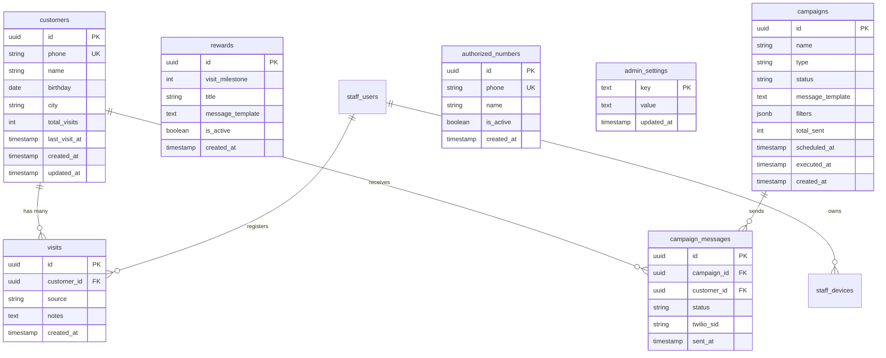

# Esquema de Base de Datos

**Base de datos:** Supabase (PostgreSQL)
**Última actualización:** 2026-05-30

---

## Diagrama ER



---

## Índice de Tablas

| # | Tabla | Descripción | RLS | Políticas |
|---|-------|-------------|-----|-----------|
| 1 | [customers](#customers) | Clientes del restaurante | SI | Admin: CRUD completo |
| 2 | [visits](#visits) | Historial de visitas | SI | Admin: CRUD completo |
| 3 | [rewards](#rewards) | Configuración de recompensas por meta | SI | Admin: CRUD completo |
| 4 | [campaigns](#campaigns) | Campañas de marketing | SI | Admin: CRUD completo |
| 5 | [campaign_messages](#campaign_messages) | Mensajes enviados por campaña | SI | Admin: lectura |
| 6 | [authorized_numbers](#authorized_numbers) | Números de meseros autorizados | SI | Admin: CRUD completo |
| 7 | [admin_settings](#admin_settings) | Configuración del admin (key-value) | SI | Admin: SELECT, INSERT, UPDATE |
| 8 | [restaurant_events](#restaurant_events) | Calendario operativo de eventos/promos con media | SI | Admin: CRUD completo |
| 9 | [restaurant_locations](#restaurant_locations) | Ubicación del restaurante para validación de geolocalización | SI | Admin: ALL, Service: SELECT |
| 10 | [staff_users](#staff_users) | Cuentas de meseros (login con PIN) | SI | Service: ALL (backend maneja auth) |
| 11 | [staff_devices](#staff_devices) | Dispositivos de confianza registrados por supervisor | SI | Service: ALL |

---

## Tablas

### customers

> Almacena los datos de los clientes del restaurante.

| Columna | Tipo | Nullable | Default | Descripción |
|---------|------|----------|---------|-------------|
| `id` | `uuid` | NO | `gen_random_uuid()` | PK |
| `phone` | `text` | NO | - | Número celular (único, formato: 3XXXXXXXXX) |
| `name` | `text` | NO | - | Nombre del cliente |
| `birthday` | `date` | SI | `NULL` | Fecha de nacimiento |
| `city` | `text` | SI | `NULL` | Ciudad del cliente |
| `total_visits` | `integer` | NO | `0` | Contador total de visitas |
| `last_visit_at` | `timestamptz` | SI | `NULL` | Fecha de última visita |
| `source_channels` | `text` | NO | `'qr'` | Origen del cliente: 'qr', 'delivery' o 'both' |
| `last_campaign_at` | `timestamptz` | SI | `NULL` | Fecha de última campaña recibida (frequency cap) |
| `accepts_marketing` | `boolean` | NO | `true` | Si el cliente acepta comunicaciones de marketing |
| `checkin_lat` | `numeric(10,8)` | SI | `NULL` | Última latitud de check-in |
| `checkin_lon` | `numeric(11,8)` | SI | `NULL` | Última longitud de check-in |
| `checkin_distance_meters` | `integer` | SI | `NULL` | Distancia al local en el último check-in (metros) |
| `created_at` | `timestamptz` | NO | `now()` | Fecha de creación |
| `updated_at` | `timestamptz` | NO | `now()` | Última actualización |

**Índices:**

| Nombre | Columnas | Tipo |
|--------|----------|------|
| `customers_pkey` | `id` | PRIMARY KEY |
| `customers_phone_key` | `phone` | UNIQUE |
| `idx_customers_checkin_location` | `(checkin_lat, checkin_lon)` | BTREE (parcial: WHERE checkin_lat IS NOT NULL) |

**Políticas RLS:**

```sql
-- Admins pueden ver todos los clientes
CREATE POLICY "admin_select_customers" ON customers
    FOR SELECT USING (auth.role() = 'authenticated');

-- Admins pueden insertar clientes
CREATE POLICY "admin_insert_customers" ON customers
    FOR INSERT WITH CHECK (auth.role() = 'authenticated');

-- Admins pueden actualizar clientes
CREATE POLICY "admin_update_customers" ON customers
    FOR UPDATE USING (auth.role() = 'authenticated');
```

**Triggers:**

| Nombre | Evento | Función |
|--------|--------|---------|
| `on_customers_updated` | BEFORE UPDATE | `handle_updated_at()` |

---

### visits

> Registro individual de cada visita de un cliente.

| Columna | Tipo | Nullable | Default | Descripción |
|---------|------|----------|---------|-------------|
| `id` | `uuid` | NO | `gen_random_uuid()` | PK |
| `customer_id` | `uuid` | NO | - | FK a customers |
| `source` | `text` | NO | `'qr'` | Origen: 'qr', 'delivery' o 'staff_scan' |
| `notes` | `text` | SI | `NULL` | Notas adicionales |
| `address` | `text` | SI | `NULL` | Dirección (domicilios) |
| `payment_method` | `text` | SI | `NULL` | Método de pago (domicilios) |
| `amount` | `numeric` | SI | `NULL` | Monto total del pedido (domicilios) |
| `raw_message` | `text` | SI | `NULL` | Mensaje raw (domicilios) |
| `table_number` | `integer` | SI | `NULL` | Número de mesa (staff_scan) |
| `registered_by_staff_id` | `uuid` | SI | `NULL` | FK a staff_users — quién registró la visita |
| `created_at` | `timestamptz` | NO | `now()` | Fecha de la visita |

**Foreign Keys:**

| Columna | Referencia | On Delete |
|---------|------------|-----------|
| `customer_id` | `customers(id)` | CASCADE |
| `registered_by_staff_id` | `staff_users(id)` | SET NULL |

---

### rewards

> Configuración de recompensas. `visit_milestone` puede ser NULL para recompensas que no se activan por visitas (uso en reactivación, campañas manuales).

| Columna | Tipo | Nullable | Default | Descripción |
|---------|------|----------|---------|-------------|
| `id` | `uuid` | NO | `gen_random_uuid()` | PK |
| `visit_milestone` | `integer` | **SI** | `NULL` | Visita que activa la recompensa. NULL = no activa por visitas, sólo se usa manualmente. |
| `title` | `text` | NO | - | Nombre de la recompensa |
| `message_template` | `text` | NO | - | Texto de referencia (display en dashboard). El cuerpo real lo define la plantilla Twilio. |
| `is_active` | `boolean` | NO | `true` | Si la recompensa está activa |
| `is_black` | `boolean` | NO | `false` | TRUE = esta recompensa marca el nivel BLACK (tier máximo, solo uno activo por instancia) |
| `created_at` | `timestamptz` | NO | `now()` | Fecha de creación |

**Índices:**

| Nombre | Columnas | Tipo | Descripción |
|--------|----------|------|-------------|
| `rewards_visit_milestone_unique` | `visit_milestone` | UNIQUE (parcial: WHERE visit_milestone IS NOT NULL) | Impide duplicados sólo cuando hay milestone |

---

### campaigns

> Campañas de marketing manuales y automáticas.

| Columna | Tipo | Nullable | Default | Descripción |
|---------|------|----------|---------|-------------|
| `id` | `uuid` | NO | `gen_random_uuid()` | PK |
| `name` | `text` | NO | - | Nombre de la campaña |
| `type` | `text` | NO | - | Tipo: 'manual', 'birthday', 'reactivation' |
| `status` | `text` | NO | `'draft'` | Estado: 'draft', 'scheduled', 'running', 'completed', 'failed' |
| `message_template` | `text` | NO | - | Template del mensaje |
| `filters` | `jsonb` | SI | `NULL` | Filtros de segmentación |
| `total_sent` | `integer` | NO | `0` | Total de mensajes enviados |
| `scheduled_at` | `timestamptz` | SI | `NULL` | Fecha programada |
| `executed_at` | `timestamptz` | SI | `NULL` | Fecha de ejecución real |
| `created_at` | `timestamptz` | NO | `now()` | Fecha de creación |
| `source` | `text` | NO | `'manual'` | Origen real: 'manual', 'calendar', 'reactivation', 'birthday'. Usado por `filterByMonthlyCap` (cuenta manual+calendar+reactivation; NO cuenta birthday). |
| `media_url` | `text` | SI | `NULL` | URL pública del media adjunto (Supabase Storage bucket `event-media`) si la campaña usa plantilla `twilio/media`. |
| `media_type` | `text` | SI | `NULL` | 'image' o 'video'. NULL para campañas de solo texto. |

**Índices nuevos (00012):**

| Nombre | Columnas | Tipo |
|--------|----------|------|
| `idx_campaigns_source_created` | `(source, created_at)` | BTREE |

---

### campaign_messages

> Registro de cada mensaje enviado dentro de una campaña.

| Columna | Tipo | Nullable | Default | Descripción |
|---------|------|----------|---------|-------------|
| `id` | `uuid` | NO | `gen_random_uuid()` | PK |
| `campaign_id` | `uuid` | NO | - | FK a campaigns |
| `customer_id` | `uuid` | NO | - | FK a customers |
| `status` | `text` | NO | `'pending'` | Estado: 'pending', 'sent', 'delivered', 'failed' |
| `twilio_sid` | `text` | SI | `NULL` | SID del mensaje en Twilio |
| `sent_at` | `timestamptz` | SI | `NULL` | Fecha de envío |
| `error_message` | `text` | SI | `NULL` | Detalle del error si falló |

**Foreign Keys:**

| Columna | Referencia | On Delete |
|---------|------------|-----------|
| `campaign_id` | `campaigns(id)` | CASCADE |
| `customer_id` | `customers(id)` | CASCADE |

---

### authorized_numbers

> Números de celular de meseros autorizados a enviar datos de domicilios.

| Columna | Tipo | Nullable | Default | Descripción |
|---------|------|----------|---------|-------------|
| `id` | `uuid` | NO | `gen_random_uuid()` | PK |
| `phone` | `text` | NO | - | Número celular del mesero |
| `name` | `text` | NO | - | Nombre del mesero |
| `is_active` | `boolean` | NO | `true` | Si está activo |
| `created_at` | `timestamptz` | NO | `now()` | Fecha de registro |

**Índices:**

| Nombre | Columnas | Tipo |
|--------|----------|------|
| `authorized_numbers_phone_key` | `phone` | UNIQUE |

---

### admin_settings

> Tabla key-value para configuraciones del administrador (ticket promedio, etc.).

| Columna | Tipo | Nullable | Default | Descripción |
|---------|------|----------|---------|-------------|
| `key` | `text` | NO | - | PK — clave de configuración (ej: 'avg_ticket') |
| `value` | `text` | NO | - | Valor de la configuración |
| `updated_at` | `timestamptz` | NO | `now()` | Última actualización |

**Índices:**

| Nombre | Columnas | Tipo |
|--------|----------|------|
| `admin_settings_pkey` | `key` | PRIMARY KEY |

**Seed data:**

| key | value | Descripción |
|-----|-------|-------------|
| `avg_ticket` | `35000` | Ticket promedio en COP para cálculo de ROI |
| `event_template_image_sid` | _(vacío inicial)_ | Twilio Content SID de plantilla `twilio/media` con imagen para invitaciones de calendario |
| `event_template_video_sid` | _(vacío inicial)_ | Twilio Content SID de plantilla `twilio/media` con video para invitaciones de calendario |
| `points_per_visit_min` | `60` | Mínimo de puntos aleatorios por visita |
| `points_per_visit_max` | `90` | Máximo de puntos aleatorios por visita |
| `welcome_bonus_points_min` | `75` | Mínimo de puntos de bienvenida al registrarse |
| `welcome_bonus_points_max` | `90` | Máximo de puntos de bienvenida al registrarse |
| `shortfall_min` | `5` | Mínimo de puntos corto en 2da visita |
| `shortfall_max` | `30` | Máximo de puntos corto en 2da visita |
| `pity_timer_threshold` | `2` | Racha de premios bajos antes de Golden Box |
| `points_system_enabled` | `true` | Feature flag: sistema de puntos activo |

**Políticas RLS:**

```sql
CREATE POLICY "admin_select_settings" ON admin_settings
  FOR SELECT USING (auth.role() = 'authenticated');

CREATE POLICY "admin_update_settings" ON admin_settings
  FOR UPDATE USING (auth.role() = 'authenticated');

CREATE POLICY "admin_insert_settings" ON admin_settings
  FOR INSERT WITH CHECK (auth.role() = 'authenticated');
```

---

### restaurant_events

> Calendario operativo de eventos/promos del restaurante. Soporta media (imagen/video) y modo de envío híbrido: `auto` (cron dispara) o `remind` (solo aviso visual al admin).

| Columna | Tipo | Nullable | Default | Descripción |
|---------|------|----------|---------|-------------|
| `id` | `uuid` | NO | `gen_random_uuid()` | PK |
| `title` | `text` | NO | - | Nombre del evento (ej: "Festival del Sushi") |
| `description` | `text` | SI | `NULL` | Descripción/CTA libre del evento |
| `event_date` | `date` | NO | - | Día del evento real |
| `event_time` | `time` | SI | `NULL` | Hora opcional del evento |
| `event_type` | `text` | NO | - | 'promo' \| 'festival' \| 'activacion' \| 'aniversario' \| 'otro' |
| `send_mode` | `text` | NO | `'remind'` | 'auto' = cron envía; 'remind' = solo recordatorio para el admin |
| `scheduled_send_at` | `timestamptz` | SI | `NULL` | Cuándo se envía (solo si `send_mode='auto'`). Debe ser ≤ `event_date`. |
| `filters` | `jsonb` | NO | `'{}'` | Filtros de audiencia (mismo shape que `campaigns.filters`) |
| `media_url` | `text` | SI | `NULL` | URL pública del bucket `event-media` |
| `media_type` | `text` | SI | `NULL` | 'image' o 'video' |
| `content_sid` | `text` | SI | `NULL` | Twilio Content SID resuelto desde `admin_settings` según `media_type` |
| `campaign_id` | `uuid` | SI | `NULL` | FK a `campaigns(id)`. Se llena cuando el evento se ejecuta. |
| `status` | `text` | NO | `'planned'` | 'planned' \| 'scheduled' \| 'sent' \| 'cancelled' \| 'failed' |
| `blackout_days` | `integer` | NO | `5` | Días antes del evento donde campañas manuales se bloquean (0-30) |
| `created_at` | `timestamptz` | NO | `now()` | Creación |
| `updated_at` | `timestamptz` | NO | `now()` | Última actualización |

**Foreign Keys:**

| Columna | Referencia | On Delete |
|---------|------------|-----------|
| `campaign_id` | `campaigns(id)` | SET NULL |

**Índices:**

| Nombre | Columnas | Tipo |
|--------|----------|------|
| `restaurant_events_pkey` | `id` | PRIMARY KEY |
| `idx_restaurant_events_date` | `event_date` | BTREE |
| `idx_restaurant_events_status` | `status` | BTREE |
| `idx_restaurant_events_scheduled` | `scheduled_send_at` (parcial: WHERE not null + status='scheduled') | BTREE |

**Triggers:**

| Nombre | Evento | Función |
|--------|--------|---------|
| `trg_restaurant_events_updated_at` | BEFORE UPDATE | `update_restaurant_events_updated_at()` |

**Políticas RLS:**

```sql
-- Admin: CRUD completo
CREATE POLICY "admin_all_restaurant_events" ON restaurant_events
  FOR ALL USING (auth.role() = 'authenticated');

-- Service role: SELECT/INSERT/UPDATE (para crons y endpoints internos)
CREATE POLICY "service_select_restaurant_events" ON restaurant_events FOR SELECT USING (true);
CREATE POLICY "service_insert_restaurant_events" ON restaurant_events FOR INSERT WITH CHECK (true);
CREATE POLICY "service_update_restaurant_events" ON restaurant_events FOR UPDATE USING (true);
```

---

### restaurant_locations

> Ubicación del restaurante para validación de geolocalización anti QR-scam.

| Columna | Tipo | Nullable | Default | Descripción |
|---------|------|----------|---------|-------------|
| `id` | `uuid` | NO | `gen_random_uuid()` | PK |
| `name` | `text` | NO | `'Sede principal'` | Nombre de la sede |
| `address` | `text` | SI | `NULL` | Dirección del local |
| `lat` | `numeric(10,8)` | NO | - | Latitud |
| `lon` | `numeric(11,8)` | NO | - | Longitud |
| `radius_meters` | `integer` | NO | `20` | Radio permitido para check-in (metros) |
| `is_active` | `boolean` | NO | `true` | Si la ubicación está activa |
| `created_at` | `timestamptz` | NO | `now()` | Fecha de creación |
| `updated_at` | `timestamptz` | NO | `now()` | Última actualización |

**Políticas RLS:**

```sql
CREATE POLICY "admin_all_restaurant_locations" ON restaurant_locations
  FOR ALL USING (auth.role() = 'authenticated');
CREATE POLICY "service_select_restaurant_locations" ON restaurant_locations
  FOR SELECT USING (true);
```

**Seed data:**

| name | address | lat | lon | radius_meters |
|------|---------|-----|-----|---------------|
| Sede principal | Actualizar dirección | 6.244203 | -75.581211 | 20 |

---

### staff_users

> Cuentas de meseros con login por PIN (hasheado con bcrypt). Roles: `waiter`, `supervisor`, `admin`.

| Columna | Tipo | Nullable | Default | Descripción |
|---------|------|----------|---------|-------------|
| `id` | `uuid` | NO | `gen_random_uuid()` | PK |
| `name` | `text` | NO | - | Nombre del mesero |
| `phone` | `text` | NO | - | Número celular (único) |
| `pin` | `text` | SI | `NULL` | PIN hasheado (bcrypt 10 rounds). NULL = deshabilitado. |
| `role` | `text` | NO | `'waiter'` | `waiter`, `supervisor`, `admin` |
| `is_active` | `boolean` | NO | `true` | Si puede hacer login |
| `last_login_at` | `timestamptz` | SI | `NULL` | Última vez que hizo login |
| `created_at` | `timestamptz` | NO | `now()` | Fecha de creación |
| `updated_at` | `timestamptz` | NO | `now()` | Última actualización |

**Índices:**

| Nombre | Columnas | Tipo |
|--------|----------|------|
| `staff_users_pkey` | `id` | PRIMARY KEY |
| `staff_users_phone_key` | `phone` | UNIQUE |

**Políticas RLS:**

```sql
CREATE POLICY "admin_select_staff_users" ON staff_users FOR SELECT USING (auth.role() = 'authenticated');
CREATE POLICY "admin_insert_staff_users" ON staff_users FOR INSERT WITH CHECK (auth.role() = 'authenticated');
CREATE POLICY "admin_update_staff_users" ON staff_users FOR UPDATE USING (auth.role() = 'authenticated');
CREATE POLICY "admin_delete_staff_users" ON staff_users FOR DELETE USING (auth.role() = 'authenticated');
```

**Triggers:**

| Nombre | Evento | Función |
|--------|--------|---------|
| `trg_staff_users_updated_at` | BEFORE UPDATE | `handle_updated_at()` |

---

### staff_devices

> Dispositivos de confianza (celulares/tablets del local) registrados por un supervisor o admin. Permite que el mesero no haga login diario.

| Columna | Tipo | Nullable | Default | Descripción |
|---------|------|----------|---------|-------------|
| `id` | `uuid` | NO | `gen_random_uuid()` | PK |
| `staff_user_id` | `uuid` | SI | `NULL` | FK opcional al mesero que registró el device |
| `device_fingerprint` | `text` | NO | - | Hash del device (UA + resolución + platform) |
| `device_name` | `text` | SI | `NULL` | Nombre descriptivo (ej: "Celular del Local") |
| `is_trusted` | `boolean` | NO | `true` | Si el device sigue siendo confiable |
| `trusted_at` | `timestamptz` | NO | `now()` | Cuándo se activó |
| `expires_at` | `timestamptz` | SI | `NULL` | Fecha de expiración (NULL = nunca expira) |
| `last_used_at` | `timestamptz` | SI | `NULL` | Última vez que se usó |
| `created_at` | `timestamptz` | NO | `now()` | Fecha de creación |

**Foreign Keys:**

| Columna | Referencia | On Delete |
|---------|------------|-----------|
| `staff_user_id` | `staff_users(id)` | SET NULL |

**Políticas RLS:**

```sql
CREATE POLICY "admin_select_staff_devices" ON staff_devices FOR SELECT USING (auth.role() = 'authenticated');
CREATE POLICY "admin_insert_staff_devices" ON staff_devices FOR INSERT WITH CHECK (auth.role() = 'authenticated');
CREATE POLICY "admin_update_staff_devices" ON staff_devices FOR UPDATE USING (auth.role() = 'authenticated');
CREATE POLICY "admin_delete_staff_devices" ON staff_devices FOR DELETE USING (auth.role() = 'authenticated');
```

---

## Storage Buckets

### event-media

> Bucket público de Supabase Storage para imágenes y videos de eventos del calendario.

- **Público:** SI (lectura anónima requerida para que Twilio/Meta puedan descargar el asset al enviar el WhatsApp)
- **Escritura:** Solo `authenticated`
- **Estructura recomendada de path:** `event-media/{event_id_or_temp}/{filename}`
- **Límites por tipo:** imagen ≤ 5MB (JPG/PNG); video ≤ 16MB (MP4) — validados a nivel de endpoint, no de Storage

**Políticas:**

| Nombre | Acción | Regla |
|--------|--------|-------|
| `event_media_public_read` | SELECT | `bucket_id='event-media'` (anónimo) |
| `event_media_admin_write` | INSERT | `bucket_id='event-media' AND auth.role()='authenticated'` |
| `event_media_admin_update` | UPDATE | `bucket_id='event-media' AND auth.role()='authenticated'` |
| `event_media_admin_delete` | DELETE | `bucket_id='event-media' AND auth.role()='authenticated'` |

---

## Historial de Migraciones

| # | Archivo | Fecha | Descripción | Estado |
|---|---------|-------|-------------|--------|
| 1 | `00001_initial_schema.sql` | 2026-04-07 | Schema inicial: customers, visits, rewards + RLS + trigger + seed data | ✅ Ejecutada |
| 2 | `00002_authorized_numbers.sql` | 2026-04-08 | Tabla authorized_numbers + RLS | Pendiente |
| 3 | `00003_delivery_fields.sql` | 2026-04-08 | Campos delivery en visits: address, payment_method, amount, raw_message | Pendiente |
| 4 | `00004_campaigns.sql` | 2026-04-08 | Tablas campaigns + campaign_messages + índices + RLS | Pendiente |
| 5 | `00005_add_city.sql` | 2026-04-08 | Campo city en customers + índice parcial | Pendiente |
| 6 | `00006_source_channels_frequency_cap.sql` | 2026-04-11 | source_channels + last_campaign_at en customers, error_message en campaign_messages, backfill | Pendiente |
| 7 | `00007_admin_settings.sql` | 2026-04-15 | Tabla admin_settings (key-value) + seed avg_ticket + RLS | Pendiente |
| 8 | `00008_accepts_marketing.sql` | 2026-04-15 | Campo accepts_marketing en customers + backfill | Pendiente |
| 9 | `00009_table_number.sql` | 2026-04-15 | Campo table_number en visits + índice | Pendiente |
| 10 | `00010_rewards_optional_milestone.sql` | 2026-05-07 | `rewards.visit_milestone` nullable + índice único parcial | Pendiente |
| 11 | `00011_rewards_black_tier.sql` | 2026-05-12 | `rewards.is_black` boolean para nivel BLACK | Pendiente |
| 12 | `00012_calendar_events_and_media.sql` | 2026-05-23 | Tabla `restaurant_events`, columnas `source/media_url/media_type` en `campaigns`, bucket `event-media` + RLS de Storage | Pendiente |
| 14 | `00014_geolocation.sql` | 2026-05-25 | Tabla `restaurant_locations`, columnas `checkin_lat/checkin_lon/checkin_distance_meters` en `customers`, función `calculate_distance()` Haversine | Pendiente |
| 15 | `00015_staff_qr_scan.sql` | 2026-05-30 | Tablas `staff_users`, `staff_devices`, FK `visits.registered_by_staff_id`, settings `checkin_mode`/`checkin_first_visit_free`, RLS staff + trigger updated_at | Pendiente |

---

## Funciones de Base de Datos

### handle_updated_at()
> Auto-actualiza `updated_at` en cada UPDATE.

```sql
CREATE OR REPLACE FUNCTION handle_updated_at()
RETURNS TRIGGER AS $$
BEGIN
  NEW.updated_at = NOW();
  RETURN NEW;
END;
$$ LANGUAGE plpgsql;
```

---

## Resumen RLS

| Tabla | SELECT | INSERT | UPDATE | DELETE |
|-------|--------|--------|--------|--------|
| customers | Admin | Admin + Service | Admin + Service | NO |
| visits | Admin | Admin + Service | NO | NO |
| rewards | Admin | Admin | Admin | Admin |
| campaigns | Admin | Admin | Admin | Admin |
| campaign_messages | Admin | Service | Service | NO |
| authorized_numbers | Admin | Admin | Admin | Admin |
| admin_settings | Admin | Admin | Admin | NO |
| restaurant_events | Admin + Service | Admin + Service | Admin + Service | Admin |
| restaurant_locations | Admin + Service | Admin | Admin | Admin |
| staff_users | Admin + Service | Admin + Service | Admin + Service | Admin |
| staff_devices | Admin + Service | Admin + Service | Admin + Service | Admin |
