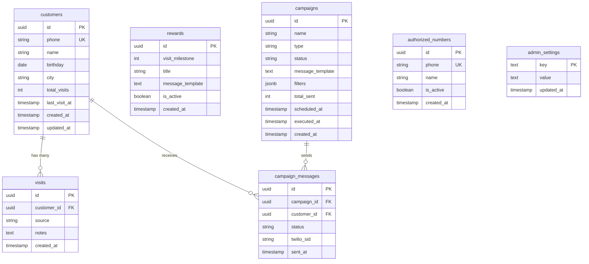

# Esquema de Base de Datos

**Base de datos:** Supabase (PostgreSQL)
**Última actualización:** 2026-04-15 12:30

---

## Diagrama ER



---

## Índice de Tablas

| # | Tabla | Descripción | RLS | Políticas |
|---|-------|-------------|-----|-----------|
| 1 | [customers](#customers) | Clientes del restaurante | SI | Admin: CRUD completo |
| 2 | [visits](#visits) | Historial de visitas | SI | Admin: CRUD completo |
| 3 | [rewards](#rewards) | Configuración de recompensas por meta | SI | Admin: CRUD completo |
| 4 | [campaigns](#campaigns) | Campañas de marketing | SI | Admin: CRUD completo |
| 5 | [campaign_messages](#campaign_messages) | Mensajes enviados por campaña | SI | Admin: lectura |
| 6 | [authorized_numbers](#authorized_numbers) | Números de meseros autorizados | SI | Admin: CRUD completo |
| 7 | [admin_settings](#admin_settings) | Configuración del admin (key-value) | SI | Admin: SELECT, INSERT, UPDATE |

---

## Tablas

### customers

> Almacena los datos de los clientes del restaurante.

| Columna | Tipo | Nullable | Default | Descripción |
|---------|------|----------|---------|-------------|
| `id` | `uuid` | NO | `gen_random_uuid()` | PK |
| `phone` | `text` | NO | - | Número celular (único, formato: 3XXXXXXXXX) |
| `name` | `text` | NO | - | Nombre del cliente |
| `birthday` | `date` | SI | `NULL` | Fecha de nacimiento |
| `city` | `text` | SI | `NULL` | Ciudad del cliente |
| `total_visits` | `integer` | NO | `0` | Contador total de visitas |
| `last_visit_at` | `timestamptz` | SI | `NULL` | Fecha de última visita |
| `source_channels` | `text` | NO | `'qr'` | Origen del cliente: 'qr', 'delivery' o 'both' |
| `last_campaign_at` | `timestamptz` | SI | `NULL` | Fecha de última campaña recibida (frequency cap) |
| `accepts_marketing` | `boolean` | NO | `true` | Si el cliente acepta comunicaciones de marketing |
| `created_at` | `timestamptz` | NO | `now()` | Fecha de creación |
| `updated_at` | `timestamptz` | NO | `now()` | Última actualización |

**Índices:**

| Nombre | Columnas | Tipo |
|--------|----------|------|
| `customers_pkey` | `id` | PRIMARY KEY |
| `customers_phone_key` | `phone` | UNIQUE |

**Políticas RLS:**

```sql
-- Admins pueden ver todos los clientes
CREATE POLICY "admin_select_customers" ON customers
    FOR SELECT USING (auth.role() = 'authenticated');

-- Admins pueden insertar clientes
CREATE POLICY "admin_insert_customers" ON customers
    FOR INSERT WITH CHECK (auth.role() = 'authenticated');

-- Admins pueden actualizar clientes
CREATE POLICY "admin_update_customers" ON customers
    FOR UPDATE USING (auth.role() = 'authenticated');
```

**Triggers:**

| Nombre | Evento | Función |
|--------|--------|---------|
| `on_customers_updated` | BEFORE UPDATE | `handle_updated_at()` |

---

### visits

> Registro individual de cada visita de un cliente.

| Columna | Tipo | Nullable | Default | Descripción |
|---------|------|----------|---------|-------------|
| `id` | `uuid` | NO | `gen_random_uuid()` | PK |
| `customer_id` | `uuid` | NO | - | FK a customers |
| `source` | `text` | NO | `'qr'` | Origen: 'qr' o 'delivery' |
| `notes` | `text` | SI | `NULL` | Notas adicionales |
| `created_at` | `timestamptz` | NO | `now()` | Fecha de la visita |

**Foreign Keys:**

| Columna | Referencia | On Delete |
|---------|------------|-----------|
| `customer_id` | `customers(id)` | CASCADE |

---

### rewards

> Configuración de recompensas que se otorgan al alcanzar metas de visitas.

| Columna | Tipo | Nullable | Default | Descripción |
|---------|------|----------|---------|-------------|
| `id` | `uuid` | NO | `gen_random_uuid()` | PK |
| `visit_milestone` | `integer` | NO | - | Número de visita que activa la recompensa (ej: 3, 5, 7) |
| `title` | `text` | NO | - | Nombre de la recompensa |
| `message_template` | `text` | NO | - | Template del mensaje WhatsApp |
| `is_active` | `boolean` | NO | `true` | Si la recompensa está activa |
| `created_at` | `timestamptz` | NO | `now()` | Fecha de creación |

---

### campaigns

> Campañas de marketing manuales y automáticas.

| Columna | Tipo | Nullable | Default | Descripción |
|---------|------|----------|---------|-------------|
| `id` | `uuid` | NO | `gen_random_uuid()` | PK |
| `name` | `text` | NO | - | Nombre de la campaña |
| `type` | `text` | NO | - | Tipo: 'manual', 'birthday', 'reactivation' |
| `status` | `text` | NO | `'draft'` | Estado: 'draft', 'scheduled', 'running', 'completed', 'failed' |
| `message_template` | `text` | NO | - | Template del mensaje |
| `filters` | `jsonb` | SI | `NULL` | Filtros de segmentación |
| `total_sent` | `integer` | NO | `0` | Total de mensajes enviados |
| `scheduled_at` | `timestamptz` | SI | `NULL` | Fecha programada |
| `executed_at` | `timestamptz` | SI | `NULL` | Fecha de ejecución real |
| `created_at` | `timestamptz` | NO | `now()` | Fecha de creación |

---

### campaign_messages

> Registro de cada mensaje enviado dentro de una campaña.

| Columna | Tipo | Nullable | Default | Descripción |
|---------|------|----------|---------|-------------|
| `id` | `uuid` | NO | `gen_random_uuid()` | PK |
| `campaign_id` | `uuid` | NO | - | FK a campaigns |
| `customer_id` | `uuid` | NO | - | FK a customers |
| `status` | `text` | NO | `'pending'` | Estado: 'pending', 'sent', 'delivered', 'failed' |
| `twilio_sid` | `text` | SI | `NULL` | SID del mensaje en Twilio |
| `sent_at` | `timestamptz` | SI | `NULL` | Fecha de envío |
| `error_message` | `text` | SI | `NULL` | Detalle del error si falló |

**Foreign Keys:**

| Columna | Referencia | On Delete |
|---------|------------|-----------|
| `campaign_id` | `campaigns(id)` | CASCADE |
| `customer_id` | `customers(id)` | CASCADE |

---

### authorized_numbers

> Números de celular de meseros autorizados a enviar datos de domicilios.

| Columna | Tipo | Nullable | Default | Descripción |
|---------|------|----------|---------|-------------|
| `id` | `uuid` | NO | `gen_random_uuid()` | PK |
| `phone` | `text` | NO | - | Número celular del mesero |
| `name` | `text` | NO | - | Nombre del mesero |
| `is_active` | `boolean` | NO | `true` | Si está activo |
| `created_at` | `timestamptz` | NO | `now()` | Fecha de registro |

**Índices:**

| Nombre | Columnas | Tipo |
|--------|----------|------|
| `authorized_numbers_phone_key` | `phone` | UNIQUE |

---

### admin_settings

> Tabla key-value para configuraciones del administrador (ticket promedio, etc.).

| Columna | Tipo | Nullable | Default | Descripción |
|---------|------|----------|---------|-------------|
| `key` | `text` | NO | - | PK — clave de configuración (ej: 'avg_ticket') |
| `value` | `text` | NO | - | Valor de la configuración |
| `updated_at` | `timestamptz` | NO | `now()` | Última actualización |

**Índices:**

| Nombre | Columnas | Tipo |
|--------|----------|------|
| `admin_settings_pkey` | `key` | PRIMARY KEY |

**Seed data:**

| key | value | Descripción |
|-----|-------|-------------|
| `avg_ticket` | `35000` | Ticket promedio en COP para cálculo de ROI |

**Políticas RLS:**

```sql
CREATE POLICY "admin_select_settings" ON admin_settings
  FOR SELECT USING (auth.role() = 'authenticated');

CREATE POLICY "admin_update_settings" ON admin_settings
  FOR UPDATE USING (auth.role() = 'authenticated');

CREATE POLICY "admin_insert_settings" ON admin_settings
  FOR INSERT WITH CHECK (auth.role() = 'authenticated');
```

---

## Historial de Migraciones

| # | Archivo | Fecha | Descripción | Estado |
|---|---------|-------|-------------|--------|
| 1 | `00001_initial_schema.sql` | 2026-04-07 | Schema inicial: customers, visits, rewards + RLS + trigger + seed data | ✅ Ejecutada |
| 2 | `00002_authorized_numbers.sql` | 2026-04-08 | Tabla authorized_numbers + RLS | Pendiente |
| 3 | `00003_delivery_fields.sql` | 2026-04-08 | Campos delivery en visits: address, payment_method, amount, raw_message | Pendiente |
| 4 | `00004_campaigns.sql` | 2026-04-08 | Tablas campaigns + campaign_messages + índices + RLS | Pendiente |
| 5 | `00005_add_city.sql` | 2026-04-08 | Campo city en customers + índice parcial | Pendiente |
| 6 | `00006_source_channels_frequency_cap.sql` | 2026-04-11 | source_channels + last_campaign_at en customers, error_message en campaign_messages, backfill | Pendiente |
| 7 | `00007_admin_settings.sql` | 2026-04-15 | Tabla admin_settings (key-value) + seed avg_ticket + RLS | Pendiente |
| 8 | `00008_accepts_marketing.sql` | 2026-04-15 | Campo accepts_marketing en customers + backfill | Pendiente |
| 9 | `00009_table_number.sql` | 2026-04-15 | Campo table_number en visits + índice | Pendiente |

---

## Funciones de Base de Datos

### handle_updated_at()
> Auto-actualiza `updated_at` en cada UPDATE.

```sql
CREATE OR REPLACE FUNCTION handle_updated_at()
RETURNS TRIGGER AS $$
BEGIN
  NEW.updated_at = NOW();
  RETURN NEW;
END;
$$ LANGUAGE plpgsql;
```

---

## Resumen RLS

| Tabla | SELECT | INSERT | UPDATE | DELETE |
|-------|--------|--------|--------|--------|
| customers | Admin | Admin + Service | Admin + Service | NO |
| visits | Admin | Admin + Service | NO | NO |
| rewards | Admin | Admin | Admin | Admin |
| campaigns | Admin | Admin | Admin | Admin |
| campaign_messages | Admin | Service | Service | NO |
| authorized_numbers | Admin | Admin | Admin | Admin |
| admin_settings | Admin | Admin | Admin | NO |
